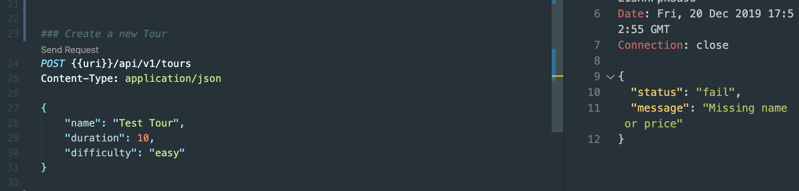
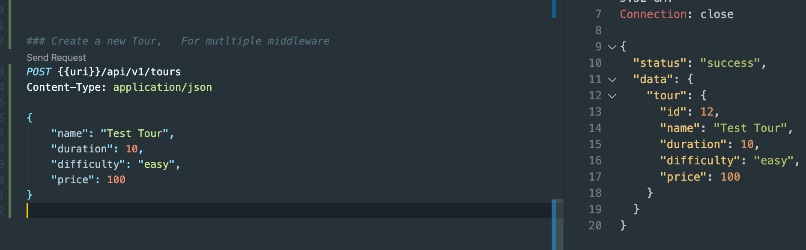

## Chainning multiple middleware
- adding a checkBody
- `controllers/tourContorller.js`
```js
//param ID is Middleware
const fs = require('fs');
const tours = JSON.parse(
    // fs.readFileSync(`${__dirname}/dev-data/data/tours-simple.json`)
    fs.readFileSync(`${__dirname}/../dev-data/data/tours-simple.json`)
);

exports.checkID = (req, res, next, val) => {
    console.log(`Tour id is: ${val}`);
    if (req.params.id * 1 > tours.length) {
        return res.status(404).json({
            status: 'fail',
            message: 'Invalid ID'
        });
    }
    next();
};

exports.checkBody = (req, res, next) => {
    if (!req.body.name || !req.body.price) {
        return res.status(400).json({
            status: 'fail',
            message: 'Missing name or price'
        })
    }
    next();
}

exports.getAllTours = (req, res) => {
    console.log(req.requestTime);

    res.status(200).json({
        status: 'success',
        requestedAt: req.requestTime,
        results: tours.length,
        data: {
            tours: tours
        }
    });
};

exports.getTour = (req, res) => {
    console.log(req.params);
    console.log(req.params.id);
    console.log(typeof (req.params.id));

    const id = req.params.id * 1;
    console.log("after converting..." + typeof (id));

    const tour = tours.find(el => (el.id === id));

    res.status(200).json({
        status: 'success',
        data: {
            tour
        }
    });
};

exports.createTour = (req, res) => {
    // console.log(req.body);

    const newId = tours[tours.length - 1].id + 1;
    const newTour = Object.assign({ id: newId }, req.body);

    tours.push(newTour);
    fs.writeFile(
        `${__dirname}/../dev-data/data/tours-simple.json`,
        JSON.stringify(tours),
        err => {
            res.status(201).json({
                status: 'success',
                data: {
                    tour: newTour
                }
            });
        }
    );
};

exports.updateTour = (req, res) => {

    res.status(200).json({
        status: 'success',
        data: {
            tour: '<Updated tour here...>'
        }
    });
};

exports.deleteTour = (req, res) => {
    res.status(204).json({//204 means not content
        status: 'success',
        data: null
    });
};
```
- tourRoutes import `checkBody`
- `routes/tourRoutes.js`
```js
//Chainning multiple middleware
const fs = require('fs');
const tours = JSON.parse(
    // fs.readFileSync(`${__dirname}/dev-data/data/tours-simple.json`)
    fs.readFileSync(`${__dirname}/../dev-data/data/tours-simple.json`)
);

exports.checkID = (req, res, next, val) => {
    console.log(`Tour id is: ${val}`);
    if (req.params.id * 1 > tours.length) {
        return res.status(404).json({
            status: 'fail',
            message: 'Invalid ID'
        });
    }
    next();
};

exports.checkBody = (req, res, next) => {
    if (!req.body.name || !req.body.price) {
        return res.status(400).json({
            status: 'fail',
            message: 'Missing name or price'
        })
    }
    next();
}

exports.getAllTours = (req, res) => {
    console.log(req.requestTime);

    res.status(200).json({
        status: 'success',
        requestedAt: req.requestTime,
        results: tours.length,
        data: {
            tours: tours
        }
    });
};

exports.getTour = (req, res) => {
    console.log(req.params);
    console.log(req.params.id);
    console.log(typeof (req.params.id));

    const id = req.params.id * 1;
    console.log("after converting..." + typeof (id));

    const tour = tours.find(el => (el.id === id));

    res.status(200).json({
        status: 'success',
        data: {
            tour
        }
    });
};

exports.createTour = (req, res) => {
    // console.log(req.body);

    const newId = tours[tours.length - 1].id + 1;
    const newTour = Object.assign({ id: newId }, req.body);

    tours.push(newTour);
    fs.writeFile(
        `${__dirname}/../dev-data/data/tours-simple.json`,
        JSON.stringify(tours),
        err => {
            res.status(201).json({
                status: 'success',
                data: {
                    tour: newTour
                }
            });
        }
    );
};

exports.updateTour = (req, res) => {

    res.status(200).json({
        status: 'success',
        data: {
            tour: '<Updated tour here...>'
        }
    });
};

exports.deleteTour = (req, res) => {
    res.status(204).json({//204 means not content
        status: 'success',
        data: null
    });
};
```

- we fail this, since for here we don't have price.
- checkBody will execute
- now we add price for our data

- checkBody will look for name OR price