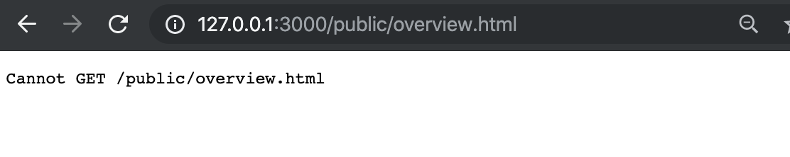
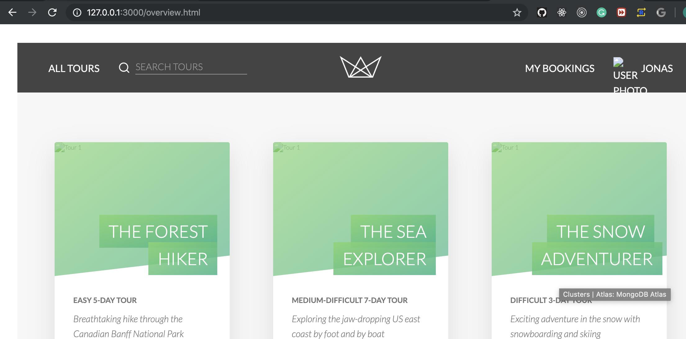
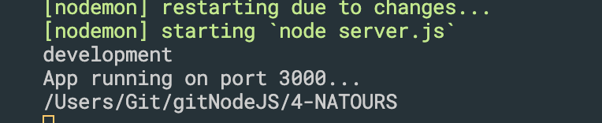
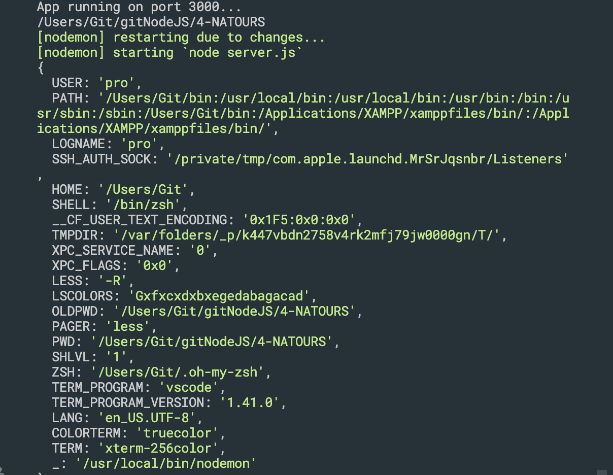
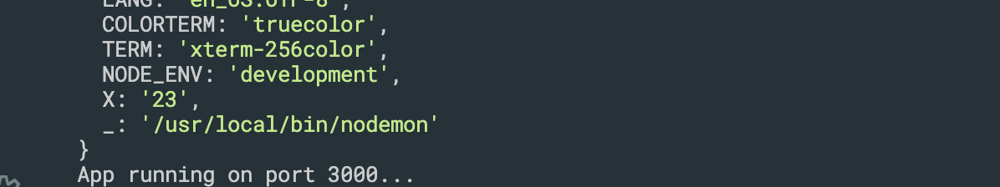
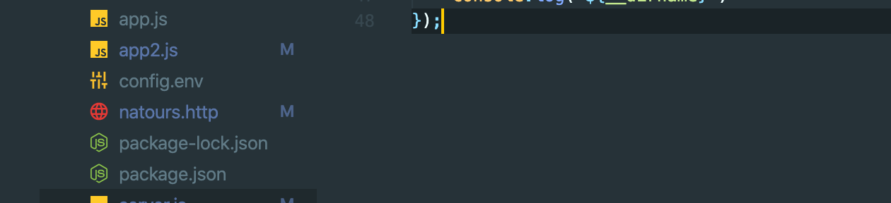
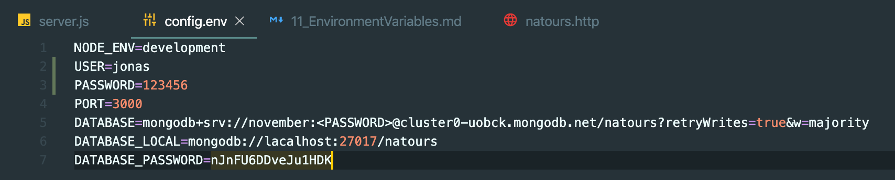
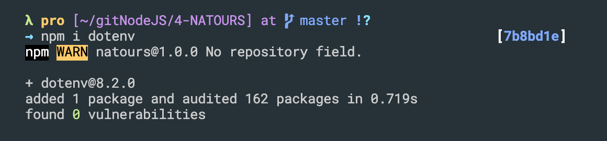
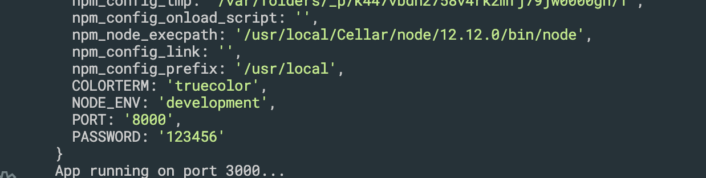

## Serving Static Files(获取静态网页)

- there is no way directly get the static .html 
- if we want to get the static file system
- using express
- update app2.js
```js
//serving static files
const express = require('express');
const morgan = require('morgan');

const tourRouter = require('./routes/tourRoutes');
const userRouter = require('./routes/userRoutes');

const app = express();

//1. middleware
app.use(morgan('dev'));
app.use(express.json()); //middleware, 中间件
app.use(express.static(`${__dirname}/public`)); //set public to be root folder, thus we don't need to input `public/`
//中间件获得静态文件
//middleware, which get the static files

app.use((req, res, next) => { //middleware
    console.log('Hello from the middleware 🐳');
    next();
});

app.use((req, res, next) => {//middleware
    req.requestTime = new Date().toISOString();
    next();
});

//3. ROUTE

app.use('/api/v1/tours', tourRouter);
app.use('/api/v1/users', userRouter);

module.exports = app;   

```

- remember, for here we just server from a folder and not from a route.
---

## Environment Variables
- update server.js
```js
//Environment Variables
const app = require('./app2');

console.log(app.get('env'));

const port = 3000;
app.listen(port, () => {
    console.log(`App running on port ${port}...`);
    console.log(`${__dirname}`)
});
```
- console

- we see development
- To summary, environment variables are global variables
----
- server.js
```js
console.log(process.env);
```

- for here, we have a bunch of different variables

### set a environment variable 
- `NODE_ENV=development X=23 nodemon server.js `

---

## Create a config.env

- btw, we can install a plugin: `DotENV`

- so now we have syntax highlighting

### now install `dotenv`

- now we config environment variable in server.js
```js
//Environment Variables
const dotenv = require('dotenv');
const app = require('./app2');

//config the environment variables on `config.env`
dotenv.config({ path: './config.env' });


//envrionment variables is global variables
// console.log(app.get('env')); 

//
console.log(process.env);

const port = 3000;
app.listen(port, () => {
    console.log(`App running on port ${port}...`);
    console.log(`${__dirname}`)
});
```
- run `npm start`, since we configed in package.json

