## DATABASE NoSQL
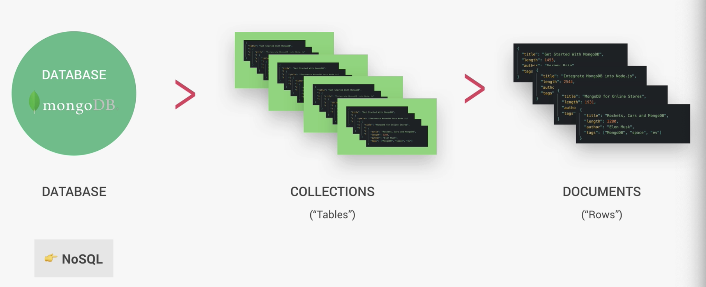
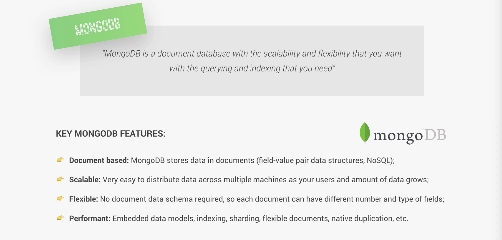
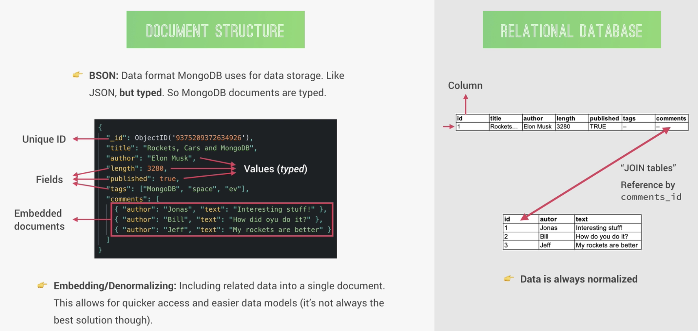
---

## Installing MongoDB on macOS
- since I have installed mongoDB
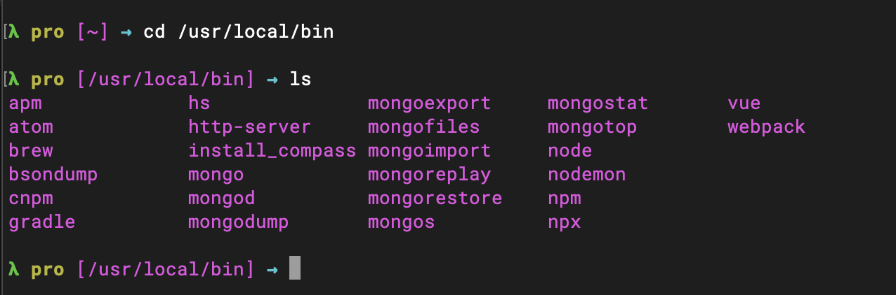
- next step:
    - create a folder where the database can then actually store the data

#### Creating a Local Database
- if a database doen't exit
- basically switch to a database that doesn't exit, it will then create a new one 
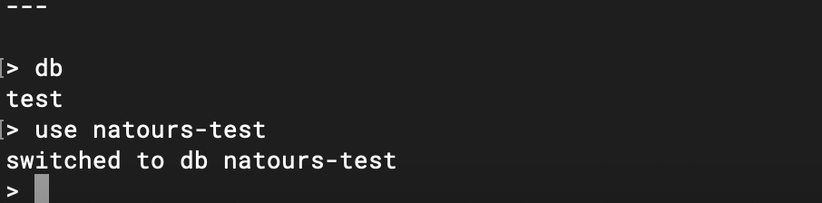
```sql
> db
test
> use natours-test
switched to db natours-test
> db.tours.insertOne({ name: "The Forest Hiker", price: 297, rating: 4.7})
{
	"acknowledged" : true,
	"insertedId" : ObjectId("5dfc6c4c6e50a7965244007e")
}
> db.tours.find()
{ "_id" : ObjectId("5dfc6c4c6e50a7965244007e"), "name" : "The Forest Hiker", "price" : 297, "rating" : 4.7 }
> show dbs
admin         0.000GB
config        0.000GB
express-test  0.000GB
local         0.000GB
natours-test  0.000GB
> use admin
switched to db admin
> use natours-test
switched to db natours-test
> show collections
tours
```
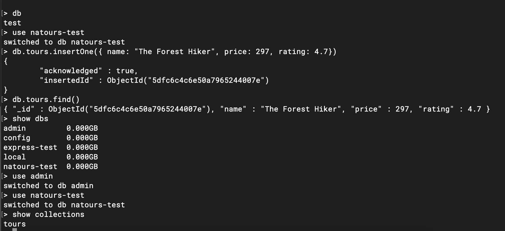
---

## CRUD: Creating Documents
```sql
> use natours-test
switched to db natours-test
> db.tours.insertMany([{ name: "The Sea Explorer", price: 497, rating: 4.8}, { name: "The Snow Adventure", price: 997, rating: 4.9, difficulty: "easy"}])
{
	"acknowledged" : true,
	"insertedIds" : [
		ObjectId("5dfc6f19a59d9953f8ed265e"),
		ObjectId("5dfc6f19a59d9953f8ed265f")
	]
}
> db.tours.find()
{ "_id" : ObjectId("5dfc6c4c6e50a7965244007e"), "name" : "The Forest Hiker", "price" : 297, "rating" : 4.7 }
{ "_id" : ObjectId("5dfc6f19a59d9953f8ed265e"), "name" : "The Sea Explorer", "price" : 497, "rating" : 4.8 }
{ "_id" : ObjectId("5dfc6f19a59d9953f8ed265f"), "name" : "The Snow Adventure", "price" : 997, "rating" : 4.9, "difficulty" : "easy" }
```
---

## CRUD: Querying(Reading)
```sql
> db.tours.find()
> use natours-test
switched to db natours-test
> db.tours.find()
{ "_id" : ObjectId("5dfc6c4c6e50a7965244007e"), "name" : "The Forest Hiker", "price" : 297, "rating" : 4.7 }
{ "_id" : ObjectId("5dfc6f19a59d9953f8ed265e"), "name" : "The Sea Explorer", "price" : 497, "rating" : 4.8 }
{ "_id" : ObjectId("5dfc6f19a59d9953f8ed265f"), "name" : "The Snow Adventure", "price" : 997, "rating" : 4.9, "difficulty" : "easy" }
> db.tours.find({ name: "The Forest Hiker"})
{ "_id" : ObjectId("5dfc6c4c6e50a7965244007e"), "name" : "The Forest Hiker", "price" : 297, "rating" : 4.7 }
> db.tours.find({difficulty:"easy"})
{ "_id" : ObjectId("5dfc6f19a59d9953f8ed265f"), "name" : "The Snow Adventure", "price" : 997, "rating" : 4.9, "difficulty" : "easy" }
> db.tours.find({ price: {$lte: 500} })
{ "_id" : ObjectId("5dfc6c4c6e50a7965244007e"), "name" : "The Forest Hiker", "price" : 297, "rating" : 4.7 }
{ "_id" : ObjectId("5dfc6f19a59d9953f8ed265e"), "name" : "The Sea Explorer", "price" : 497, "rating" : 4.8 }
> db.tours.find({ price: {$lt: 500}, rating: {$gte: 4.8}})
{ "_id" : ObjectId("5dfc6f19a59d9953f8ed265e"), "name" : "The Sea Explorer", "price" : 497, "rating" : 4.8 }
> 
> 
> 
> db.tours.find({ $or: [ {price:{$lt:500}, {rating: {$gte: 4.8}}} ] })
2019-12-19T23:02:20.146-0800 E  QUERY    [js] uncaught exception: SyntaxError: expected property name, got '{' :
@(shell):1:41
> db.tours.find({ $or: [ {price:{$lt:500}}, {rating: {$gte: 4.8}} ] })
{ "_id" : ObjectId("5dfc6c4c6e50a7965244007e"), "name" : "The Forest Hiker", "price" : 297, "rating" : 4.7 }
{ "_id" : ObjectId("5dfc6f19a59d9953f8ed265e"), "name" : "The Sea Explorer", "price" : 497, "rating" : 4.8 }
{ "_id" : ObjectId("5dfc6f19a59d9953f8ed265f"), "name" : "The Snow Adventure", "price" : 997, "rating" : 4.9, "difficulty" : "easy" }
> 
> 
> 
> 
> db.tours.find({ $or: [ {price:{$lt:500}}, {rating: {$gte: 4.8}} ] })
{ "_id" : ObjectId("5dfc6c4c6e50a7965244007e"), "name" : "The Forest Hiker", "price" : 297, "rating" : 4.7 }
{ "_id" : ObjectId("5dfc6f19a59d9953f8ed265e"), "name" : "The Sea Explorer", "price" : 497, "rating" : 4.8 }
{ "_id" : ObjectId("5dfc6f19a59d9953f8ed265f"), "name" : "The Snow Adventure", "price" : 997, "rating" : 4.9, "difficulty" : "easy" }
> 
> 
> 
> db.tours.find({ $or: [ {price:{$gt:500}}, {rating: {$gte: 4.8}} ] })
{ "_id" : ObjectId("5dfc6f19a59d9953f8ed265e"), "name" : "The Sea Explorer", "price" : 497, "rating" : 4.8 }
{ "_id" : ObjectId("5dfc6f19a59d9953f8ed265f"), "name" : "The Snow Adventure", "price" : 997, "rating" : 4.9, "difficulty" : "easy" }
> 
> 
> 
> 
> db.tours.find({ $or: [ {price:{$gt:500}}, {rating: {$gte: 4.8}} ] }, {name: 1})
{ "_id" : ObjectId("5dfc6f19a59d9953f8ed265e"), "name" : "The Sea Explorer" }
{ "_id" : ObjectId("5dfc6f19a59d9953f8ed265f"), "name" : "The Snow Adventure" }
> 


###  lt means "less than",    gte mean "great thatn equal"
```


## Using Compass App for CRUD
- go to `MongoDB Download Center`
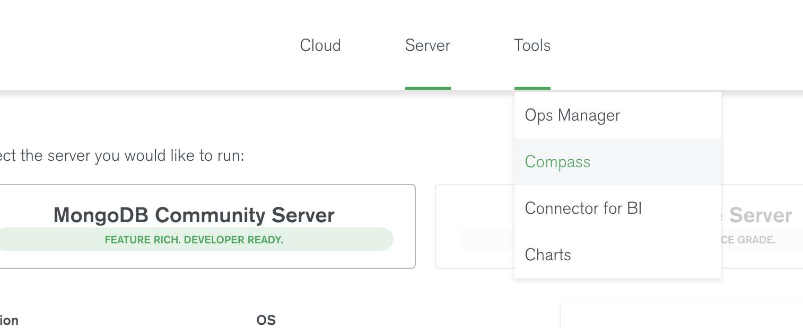
- click Download
- then click connect
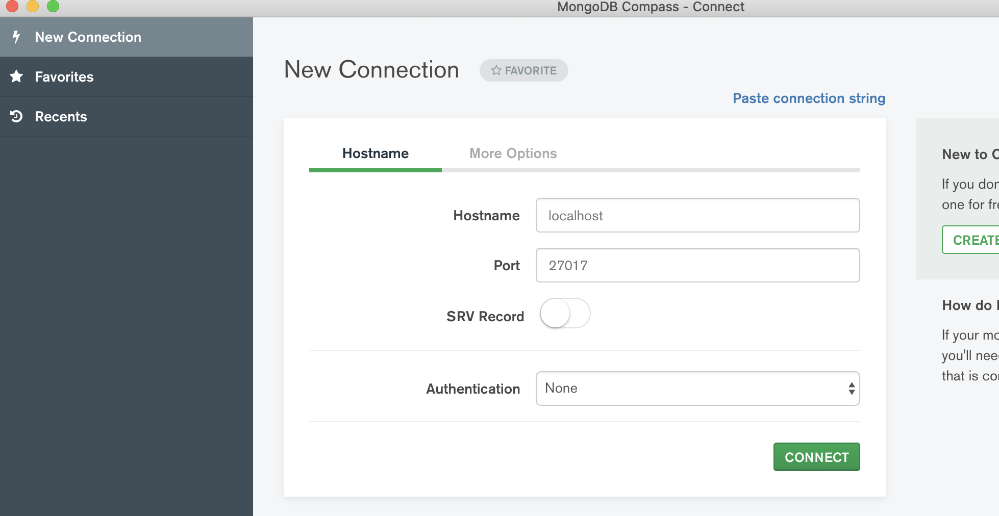
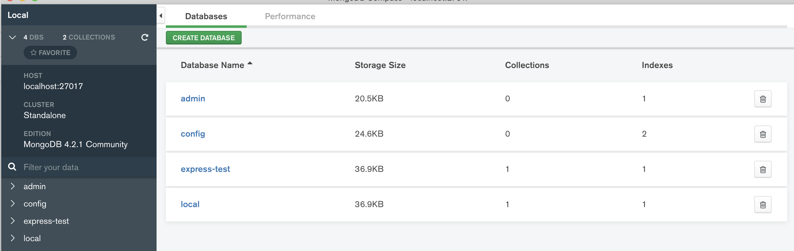
- `brew services start mongodb-community`

- after start service
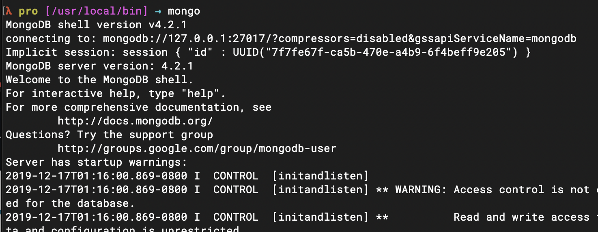


---
### Creating a Hosted Database Atlas
- create a new account for mongodb
- create a new project
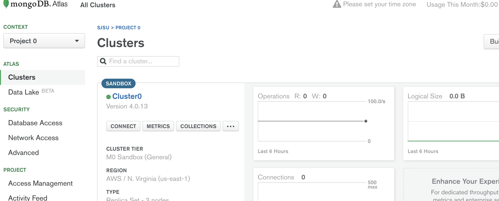
- name my project
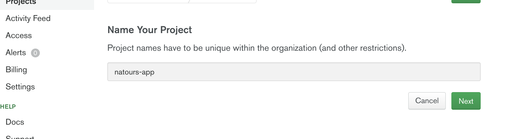
- click next

- click create cluster
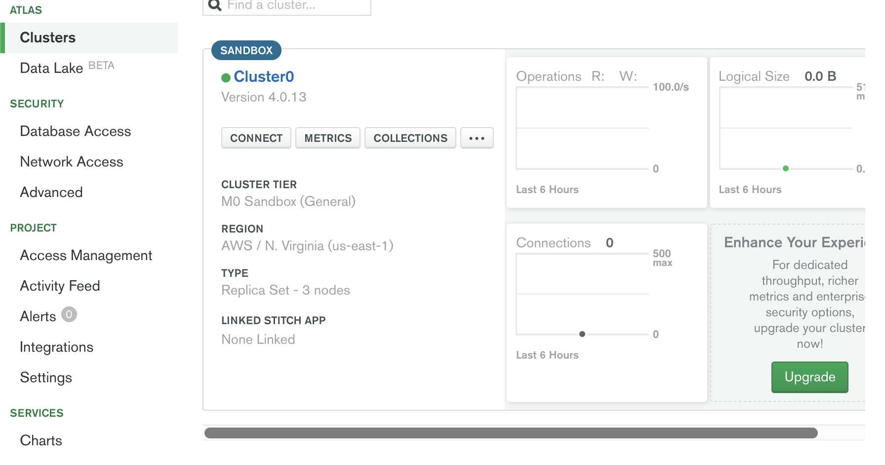
---

### connecting to Our Hosted
- click `CONNECT`
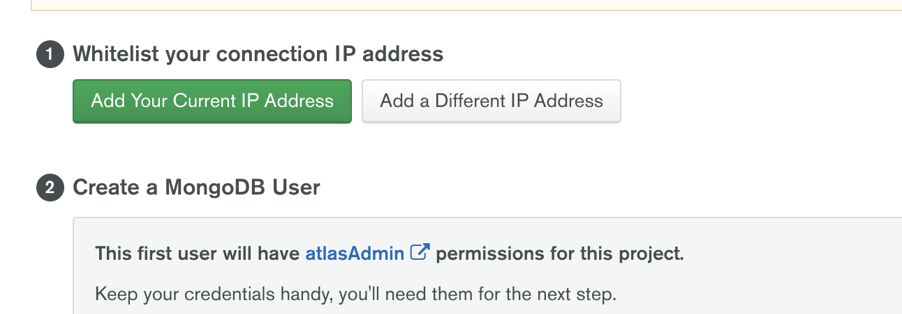
- Add your IP address
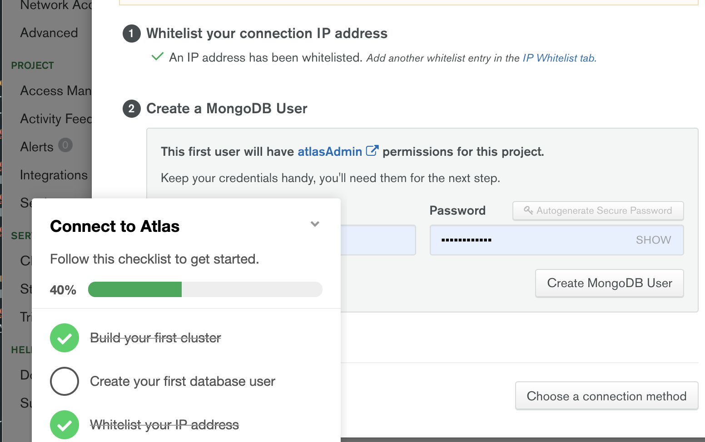
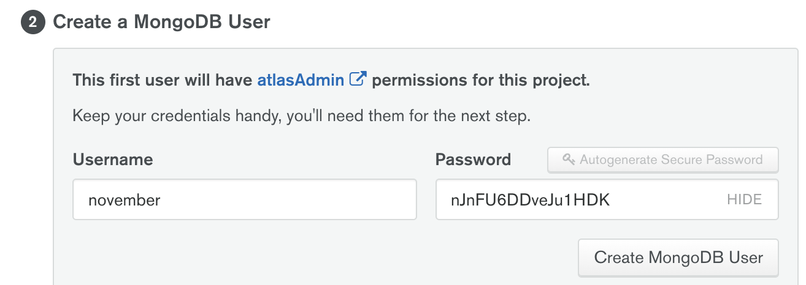
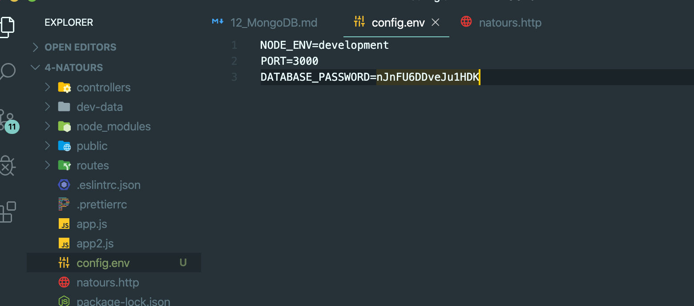
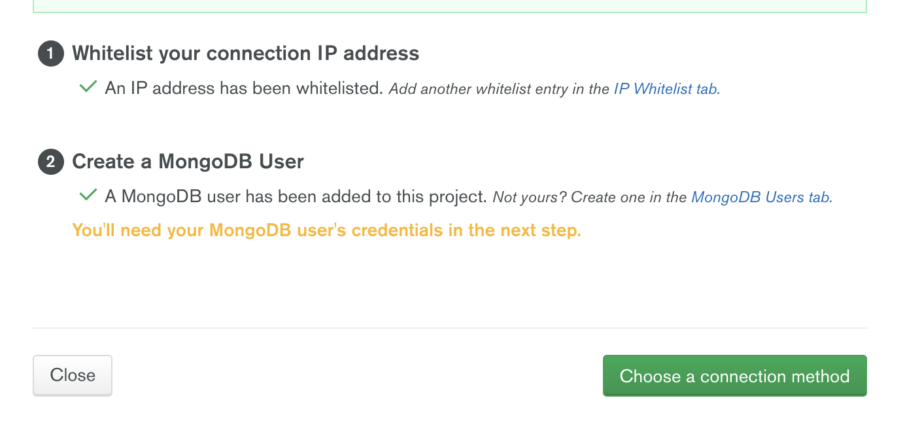
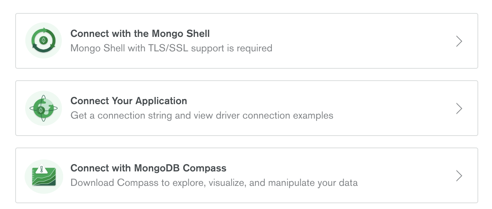
- choose: `Connect with MongoDB Compass`
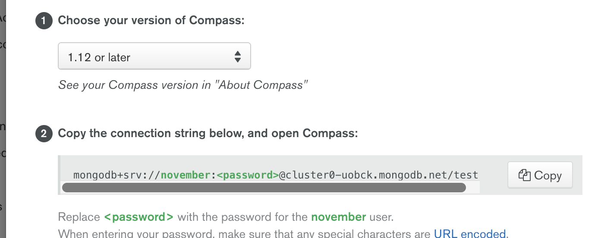
- click copy


