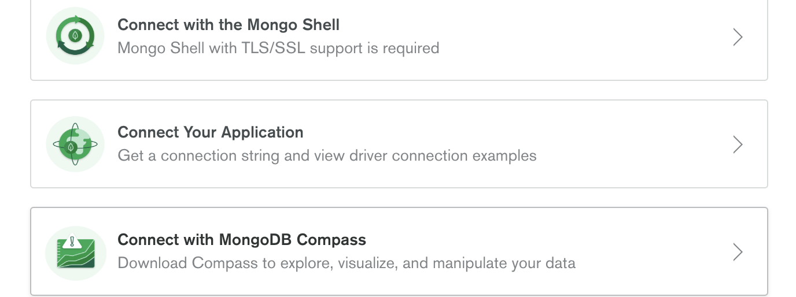
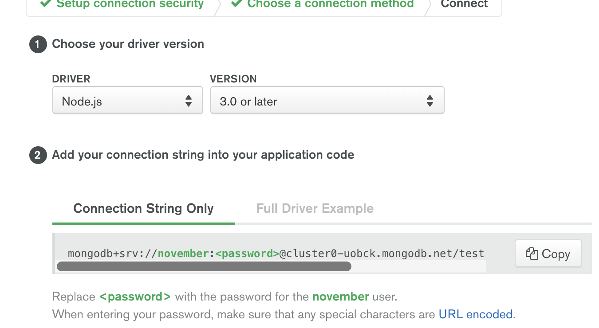
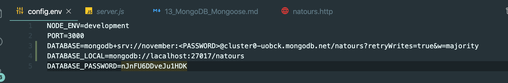
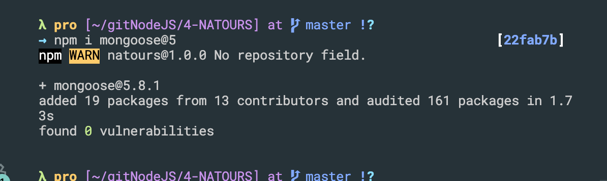
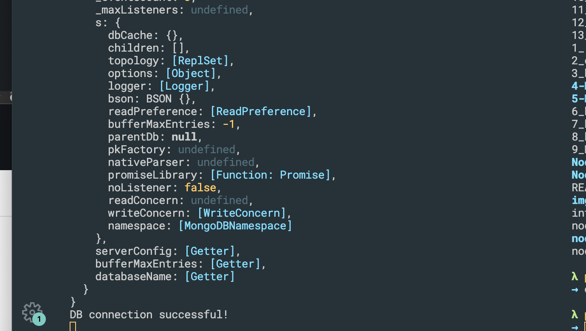
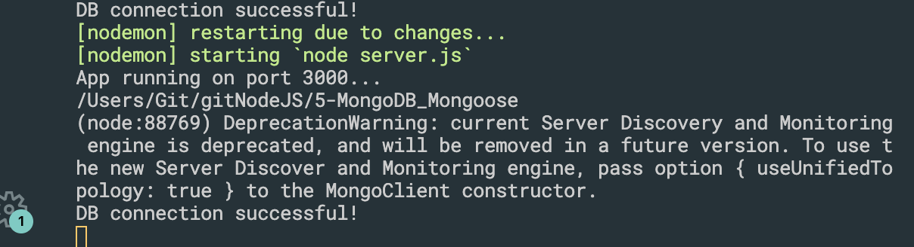
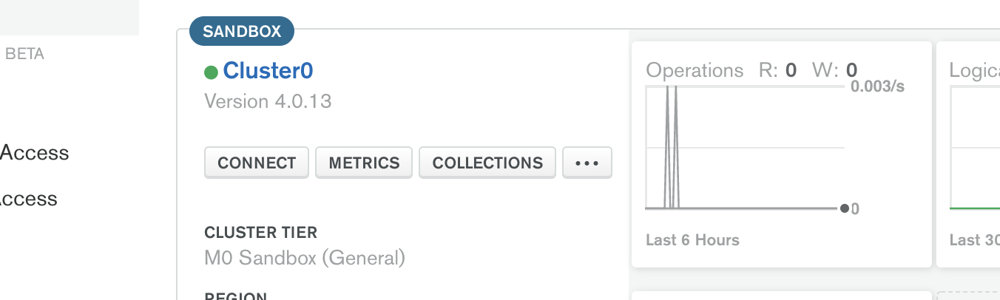
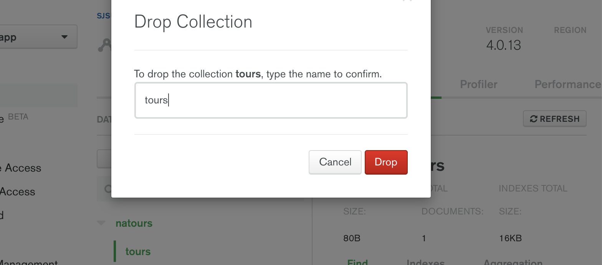

## Connecting Our Database with the Express App

- This time, choose connect to our application

- COPY
- back to our application
- let's configure

- lte's install mongoose


### update server.js
```js
//Connecting Our Database with the Express App
const mongoose = require('mongoose');
const dotenv = require('dotenv');
dotenv.config({ path: './config.env' });

const DB = process.env.DATABASE.replace('<PASSWORD>', process.env.DATABASE_PASSWORD);

mongoose.connect(DB, {
    useNewUrlParser: true,
    useCreateIndex: true,
    useFindAndModify: false
}).then(con => {
    console.log(con.connection);
    console.log('DB connection successful!');
})

const app = require('./app');


const port = process.env.PORT || 3000;
app.listen(port, () => {
    console.log(`App running on port ${port}...`);
    console.log(`${__dirname}`)
});
```

---
### update server.js
```js
//Connecting Our Database with the Express App
const mongoose = require('mongoose');
const dotenv = require('dotenv');
dotenv.config({ path: './config.env' });

const DB = process.env.DATABASE.replace('<PASSWORD>', process.env.DATABASE_PASSWORD);

mongoose.connect(DB, {
    useNewUrlParser: true,
    useCreateIndex: true,
    useFindAndModify: false
}).then(() => {
    console.log('DB connection successful!');
})

const app = require('./app');

const port = process.env.PORT || 3000;
app.listen(port, () => {
    console.log(`App running on port ${port}...`);
    console.log(`${__dirname}`)
});
```

---

### update server.js
```js
//Connecting Our Database with the Express App
const mongoose = require('mongoose');
const dotenv = require('dotenv');
dotenv.config({ path: './config.env' });

const DB = process.env.DATABASE.replace('<PASSWORD>', process.env.DATABASE_PASSWORD);

mongoose.connect(DB, {
    useNewUrlParser: true,
    useCreateIndex: true,
    useFindAndModify: false
}).then(() => {
    console.log('DB connection successful!');
})

// mongoose.connect(process.env.DATABASE_LOCAL, {
//     useNewUrlParser: true,
//     useCreateIndex: true,
//     useFindAndModify: false
// }).then(() => {
//     console.log('DB connection successful!');
// })


const app = require('./app');

const port = process.env.PORT || 3000;
app.listen(port, () => {
    console.log(`App running on port ${port}...`);
    console.log(`${__dirname}`)
});
```
---

### now we delete tours from Cluster0, 

- click collections

- drop tours
---


## What is Mongoose?

---


## Creating a Simple Tour Model