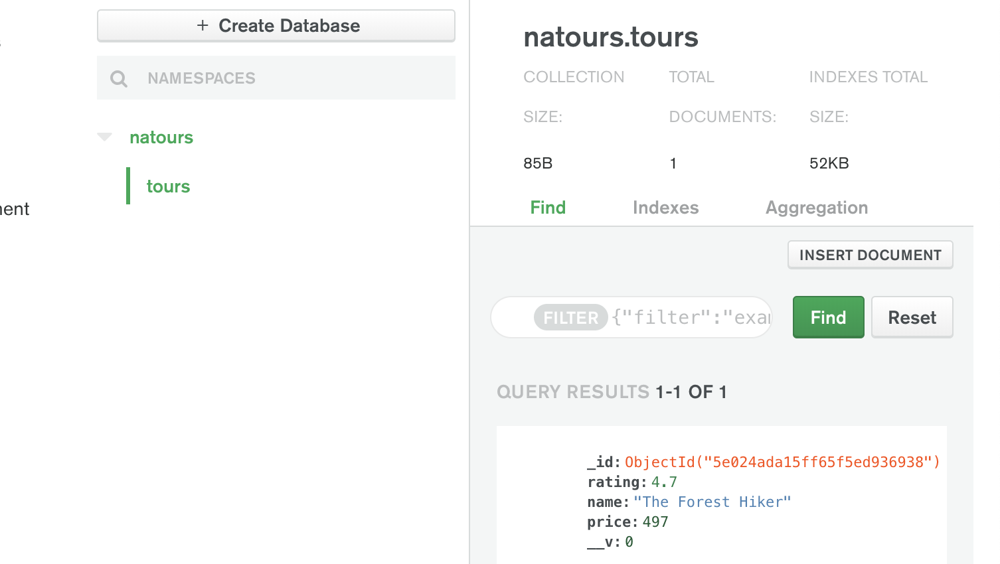
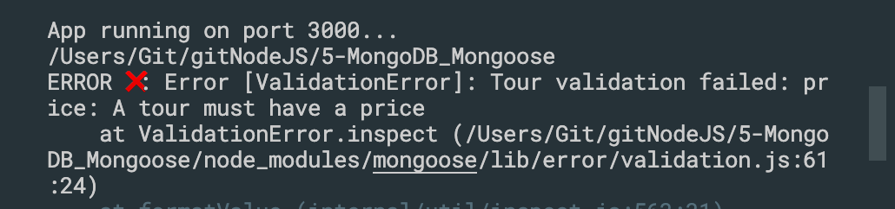
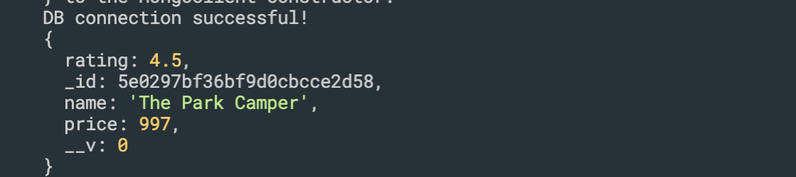
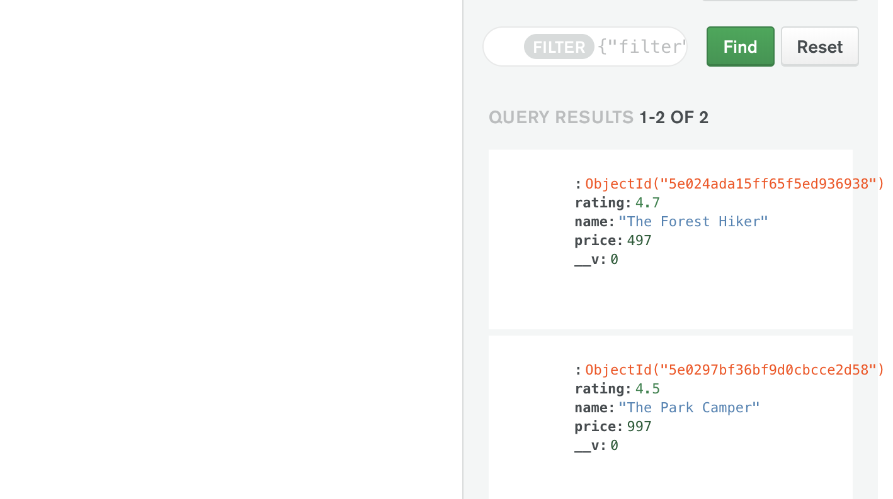

## Connecting Our Database with the Express App

- This time, choose connect to our application

- COPY
- back to our application
- let's configure

- lte's install mongoose


### update server.js
```js
//Connecting Our Database with the Express App
const mongoose = require('mongoose');
const dotenv = require('dotenv');
dotenv.config({ path: './config.env' });

const DB = process.env.DATABASE.replace('<PASSWORD>', process.env.DATABASE_PASSWORD);

mongoose.connect(DB, {
    useNewUrlParser: true,
    useCreateIndex: true,
    useFindAndModify: false
}).then(con => {
    console.log(con.connection);
    console.log('DB connection successful!');
})

const app = require('./app');


const port = process.env.PORT || 3000;
app.listen(port, () => {
    console.log(`App running on port ${port}...`);
    console.log(`${__dirname}`)
});
```

---
### update server.js
```js
//Connecting Our Database with the Express App
const mongoose = require('mongoose');
const dotenv = require('dotenv');
dotenv.config({ path: './config.env' });

const DB = process.env.DATABASE.replace('<PASSWORD>', process.env.DATABASE_PASSWORD);

mongoose.connect(DB, {
    useNewUrlParser: true,
    useCreateIndex: true,
    useFindAndModify: false
}).then(() => {
    console.log('DB connection successful!');
})

const app = require('./app');

const port = process.env.PORT || 3000;
app.listen(port, () => {
    console.log(`App running on port ${port}...`);
    console.log(`${__dirname}`)
});
```

---

### update server.js
```js
//Connecting Our Database with the Express App
const mongoose = require('mongoose');
const dotenv = require('dotenv');
dotenv.config({ path: './config.env' });

const DB = process.env.DATABASE.replace('<PASSWORD>', process.env.DATABASE_PASSWORD);

mongoose.connect(DB, {
    useNewUrlParser: true,
    useCreateIndex: true,
    useFindAndModify: false
}).then(() => {
    console.log('DB connection successful!');
})

// mongoose.connect(process.env.DATABASE_LOCAL, {
//     useNewUrlParser: true,
//     useCreateIndex: true,
//     useFindAndModify: false
// }).then(() => {
//     console.log('DB connection successful!');
// })


const app = require('./app');

const port = process.env.PORT || 3000;
app.listen(port, () => {
    console.log(`App running on port ${port}...`);
    console.log(`${__dirname}`)
});
```
---

### now we delete tours from Cluster0, 

- click collections

- drop tours
---


## What is Mongoose?

---


## Creating a Simple Tour Model
- update server.js
```js
//Creating a Simple Tour Model
const mongoose = require('mongoose');
const dotenv = require('dotenv');
dotenv.config({ path: './config.env' });

const DB = process.env.DATABASE.replace('<PASSWORD>', process.env.DATABASE_PASSWORD);

mongoose.connect(DB, {
    useNewUrlParser: true,
    useCreateIndex: true,
    useFindAndModify: false
}).then(() => {
    console.log('DB connection successful!');
})

const tourSchema = new mongoose.Schema({
    name: {
        type: String,
        required: [true, 'A tour must have a nme'],
        unique: true //we can't have tour documents with the same name
    },
    rating: {
        type: Number,
        default: 4.5
    },
    price: {
        type: Number,
        required: [true, 'A tour must have a price']
    }
});
const Tour = mongoose.model('Tour', tourSchema);


const app = require('./app');

const port = process.env.PORT || 3000;
app.listen(port, () => {
    console.log(`App running on port ${port}...`);
    console.log(`${__dirname}`)
});
```
---

## Creating Documents and Testing the model
- update server.js
```js
//Creating Documents and Testing the model
const mongoose = require('mongoose');
const dotenv = require('dotenv');
dotenv.config({ path: './config.env' });

const DB = process.env.DATABASE.replace('<PASSWORD>', process.env.DATABASE_PASSWORD);

mongoose.connect(DB, {
    useNewUrlParser: true,
    useCreateIndex: true,
    useFindAndModify: false
}).then(() => {
    console.log('DB connection successful!');
})

const tourSchema = new mongoose.Schema({
    name: {
        type: String,
        required: [true, 'A tour must have a nme'],
        unique: true //we can't have tour documents with the same name
    },
    rating: {
        type: Number,
        default: 4.5
    },
    price: {
        type: Number,
        required: [true, 'A tour must have a price']
    }
});
const Tour = mongoose.model('Tour', tourSchema);

const testTour = new Tour({
    name: 'The Forest Hiker',
    rating: 4.7,
    price: 497
});

//save the tours collection into the database, save() return a promise
testTour.save().then(doc => {
    console.log(doc);
}).catch(err => {
    console.log('ERROR ❌:', err);
});

const app = require('./app');

const port = process.env.PORT || 3000;
app.listen(port, () => {
    console.log(`App running on port ${port}...`);
    console.log(`${__dirname}`)
});
```


- if we insert this testTour agian, it will generate error, since name is unique
- but what if we insert a new tour, without price, see what happen:
```js
const testTour = new Tour({
    name: 'The Park Camper'
});
```

- that error: A tour must have a value
```js
const testTour = new Tour({
    name: 'The Park Camper',
    price: 997
});
```

- for here, we didn't set rating, but its default is 4.5
```js
    rating: {
        type: Number,
        default: 4.5
    },
```
- thus, we get the rating's value is 4.5

---


