## Intro to Back-End Architecture(建筑学): MVC, Types of Logic, and More


---


## Refactoring for MVC
- create a new folder

- tourModels.js
```js
const mongoose = require('mongoose');
const tourSchema = new mongoose.Schema({
    name: {
        type: String,
        required: [true, 'A tour must have a nme'],
        unique: true //we can't have tour documents with the same name
    },
    rating: {
        type: Number,
        default: 4.5
    },
    price: {
        type: Number,
        required: [true, 'A tour must have a price']
    }
});
const Tour = mongoose.model('Tour', tourSchema);
module.exports = Tour;
```
- update tourRoutes.js
```js
const express = require('express');

const {
    // checkID,
    checkBody,
    getAllTours,
    createTour,
    getTour,
    updateTour,
    deleteTour
} = require('../controllers/tourController');


const router = express.Router();

//checkID testing for middleware
// router.param('id', checkID);

router.route('/')
    .get(getAllTours)
    .post(checkBody, createTour);

router.route('/:id')
    .get(getTour)
    .patch(updateTour)
    .delete(deleteTour);

module.exports = router;
```
- update tourController.js
```js
const Tour = require('./../models/tourModel');

//this checkID function we no longer need it, because we start working with the IDs that are coming 
//from MongoDB, and Mongo itself will give us an error if we use invalid ID, 
//this function really useful for showing you how middleware actually works
/* 
exports.checkID = (req, res, next, val) => {
    console.log(`Tour id is: ${val}`);
    if (req.params.id * 1 > tours.length) {
        return res.status(404).json({
            status: 'fail',
            message: 'Invalid ID'
        });
    }
    next();
}; 
*/

exports.checkBody = (req, res, next) => {
    if (!req.body.name || !req.body.price) {
        return res.status(400).json({
            status: 'fail',
            message: 'Missing name or price'
        })
    }
    next();
}

exports.getAllTours = (req, res) => {
    console.log(req.requestTime);

    res.status(200).json({
        status: 'success',
        requestedAt: req.requestTime,
    });
};

exports.getTour = (req, res) => {
    console.log(req.params);
    console.log(req.params.id);
    console.log(typeof (req.params.id));

    const id = req.params.id * 1;
    console.log("after converting..." + typeof (id));
};

exports.createTour = (req, res) => {
    res.status(201).json({
        status: 'success',
    });
};

exports.updateTour = (req, res) => {

    res.status(200).json({
        status: 'success',
        data: {
            tour: '<Updated tour here...>'
        }
    });
};

exports.deleteTour = (req, res) => {
    res.status(204).json({//204 means not content
        status: 'success',
        data: null
    });
};
```
- update server.js
```js
//Refactoring for MVC
const mongoose = require('mongoose');
const dotenv = require('dotenv');
const app = require('./app');

dotenv.config({ path: './config.env' });

const DB = process.env.DATABASE.replace('<PASSWORD>', process.env.DATABASE_PASSWORD);

mongoose.connect(DB, {
    useNewUrlParser: true,
    useCreateIndex: true,
    useFindAndModify: false
}).then(() => {
    console.log('DB connection successful!');
})


const port = process.env.PORT || 3000;
app.listen(port, () => {
    console.log(`App running on port ${port}...`);
    console.log(`${__dirname}`)
});
```
---

## Another Way of Creating Documents
- update tourController.js
```js

//Another Way of Creating Documents
const Tour = require('./../models/tourModel');

//this checkID function we no longer need it, because we start working with the IDs that are coming 
//from MongoDB, and Mongo itself will give us an error if we use invalid ID, 
//this function really useful for showing you how middleware actually works
/* 
exports.checkID = (req, res, next, val) => {
    console.log(`Tour id is: ${val}`);
    if (req.params.id * 1 > tours.length) {
        return res.status(404).json({
            status: 'fail',
            message: 'Invalid ID'
        });
    }
    next();
}; 
*/


exports.getAllTours = (req, res) => {
    console.log(req.requestTime);

    res.status(200).json({
        status: 'success',
        requestedAt: req.requestTime,
        // results: tours.length,
        // data: {
        //     tours: tours
        // }
    });
};

exports.getTour = (req, res) => {
    console.log(req.params);
    console.log(req.params.id);
    console.log(typeof (req.params.id));

    const id = req.params.id * 1;
    console.log("after converting..." + typeof (id));

    // const tour = tours.find(el => (el.id === id));

    // res.status(200).json({
    //     status: 'success',
    //     data: {
    //         tour
    //     }
    // });
};

exports.createTour = async (req, res) => {
    try {
        // //the first way to create a new document, and save() return a promise
        // const newTours = new Tour({})
        // newTour.save()

        //2nd way to create a new document, create() return a promise as well as save()
        const newTour = await Tour.create(req.body);
        //if use async, we don't neet to use .then()


        res.status(201).json({
            status: 'success',
            data: {
                tour: newTour
            }
        });
    } catch (err) {
        res.status(400).json({
            status: 'fail',
            message: err
        })
    }
};

exports.updateTour = (req, res) => {

    res.status(200).json({
        status: 'success',
        data: {
            tour: '<Updated tour here...>'
        }
    });
};

exports.deleteTour = (req, res) => {
    res.status(204).json({//204 means not content
        status: 'success',
        data: null
    });
};
```
- let's testing .http
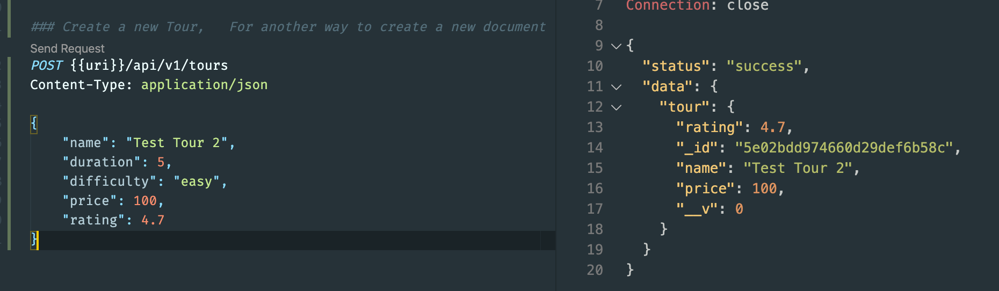
- now you might notice that we have no difficulty and no duration 
- that's because that are actually not in our schema is simply ignored.
- 
- now we try to send again? to see what happen?
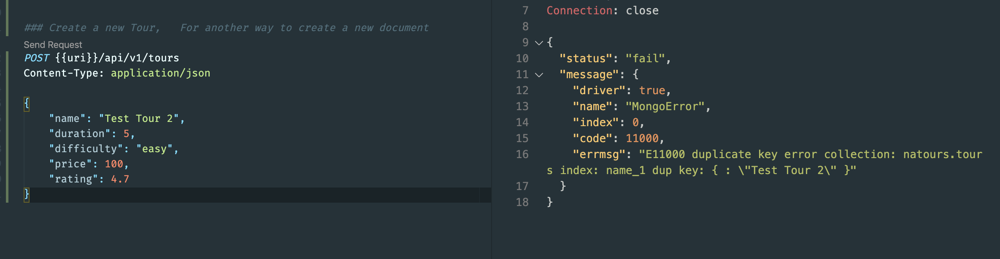
- because we already have the Test Tour 2, And so it coould not create another one
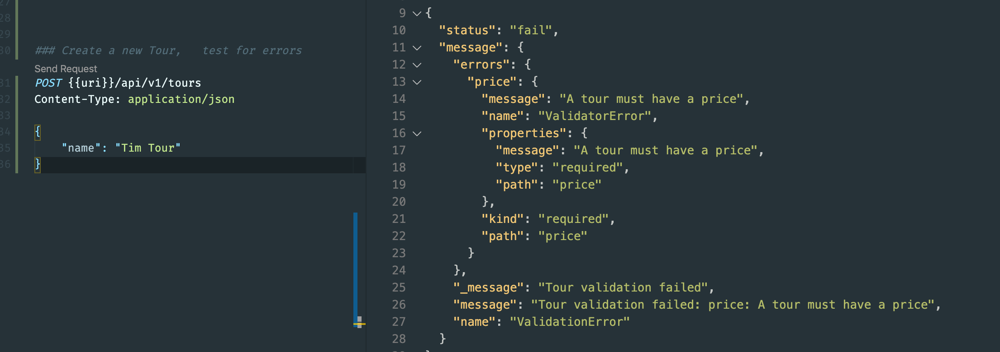
---

## Reading Documents
- update tourController.js
```js
//Reading Documents
const Tour = require('./../models/tourModel');

exports.getAllTours = async (req, res) => {
    try {
        const tours = await Tour.find();

        res.status(200).json({
            status: 'success',
            requestedAt: req.requestTime,
            results: tours.length,
            data: {
                tours: tours
            }
        });
    } catch (error) {
        res.status(404).json({
            status: 'fail',
            message: error
        });
    }
};
```
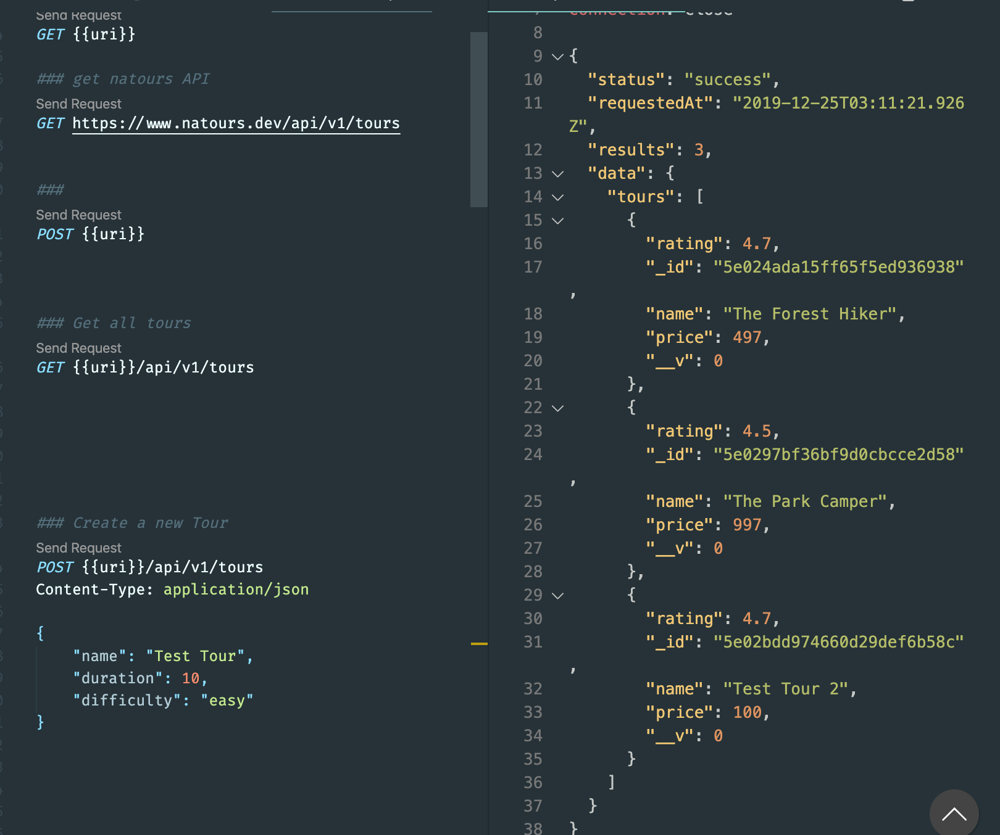
- get one Tour
```JS
exports.getTour = async (req, res) => {
    try {
        const tour = await Tour.findById(req.params.id);
        //Tour.findOne({ _id: req.params.id})

        res.status(200).json({
            status: 'success',
            data: {
                tour
            }
        });
    } catch (err) {
        res.status(404).json({
            status: 'fail',
            message: error
        });
    }
};
```
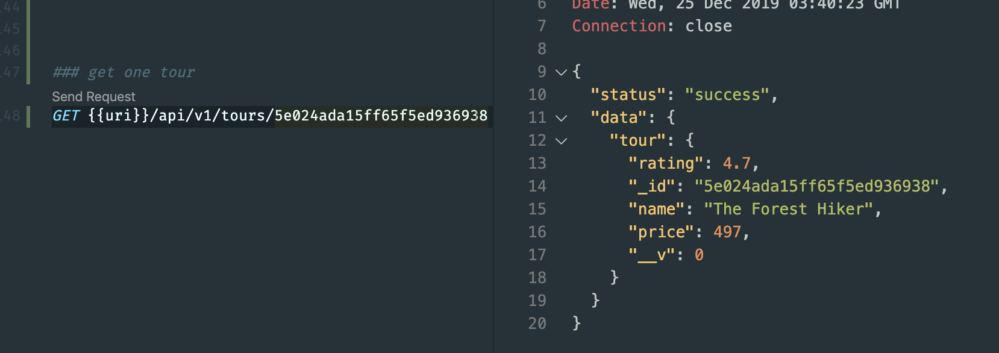
---


## Updating Document
- tourController.js
```js
exports.updateTour = async (req, res) => {
    try {
        const tour = await Tour.findByIdAndUpdate(req.params.id, req.body, {
            new: true,
            runValidators: true
        })
        res.status(200).json({
            status: 'success',
            data: {
                tour: tour
            }
        });
    } catch (err) {
        res.status(400).json({
            status: 'fail',
            message: err
        })
    }
};
```
- since we have `runValidators: true`, thus if insert a data with different type, what happen?
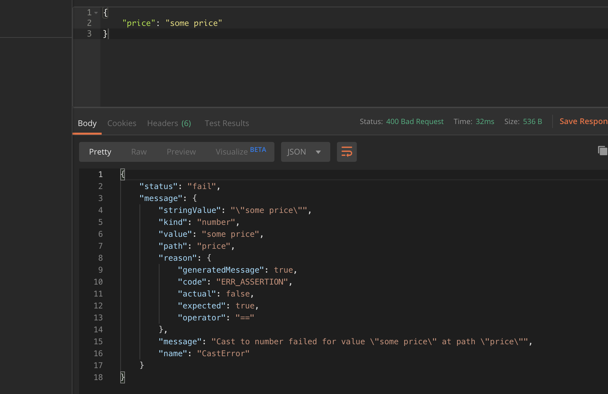
---
-
- change to Number
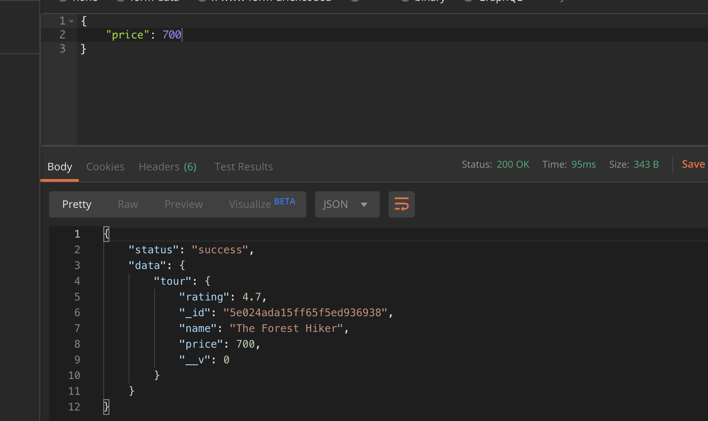
---

## Deleting Documents
- create a document for testing
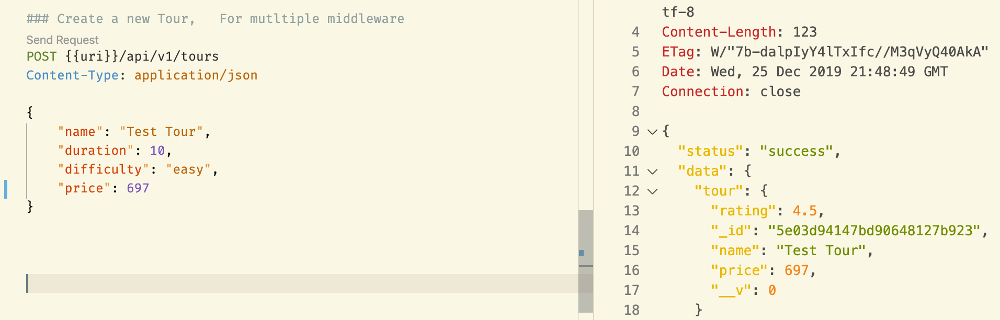
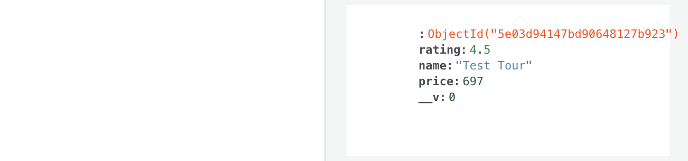
---
- now let's delete it
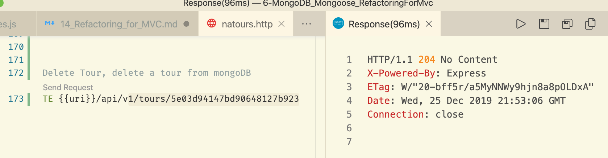
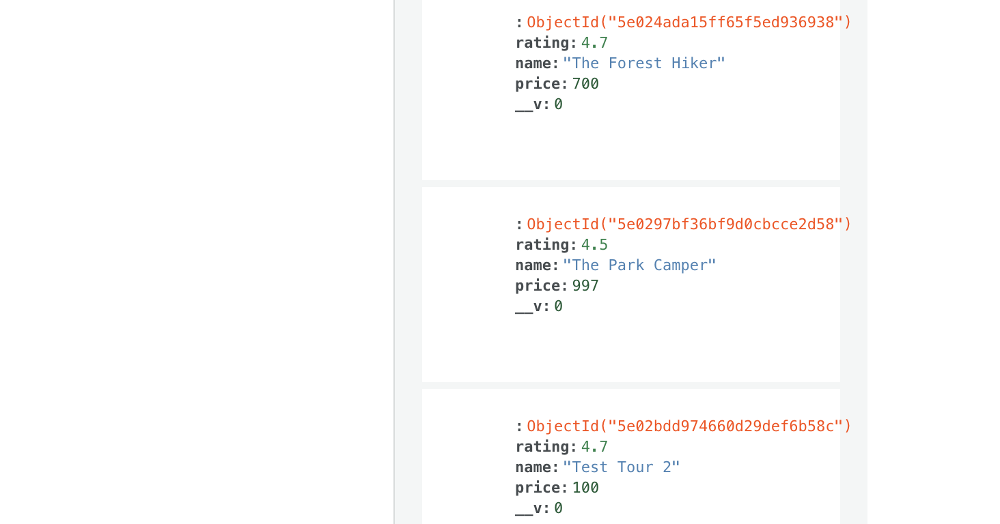
---


