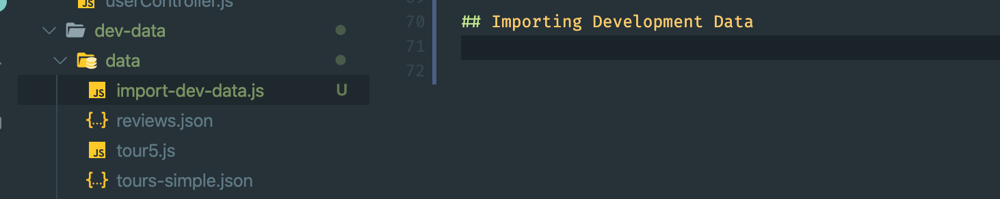
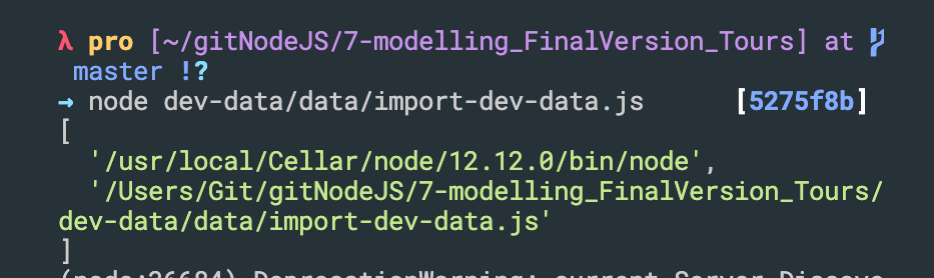
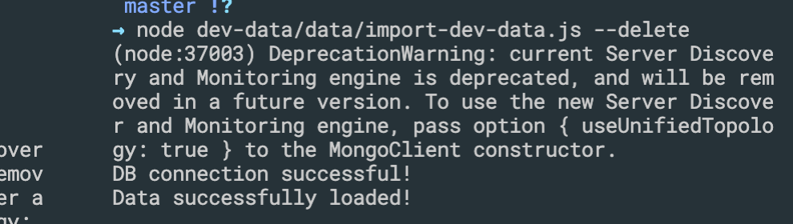
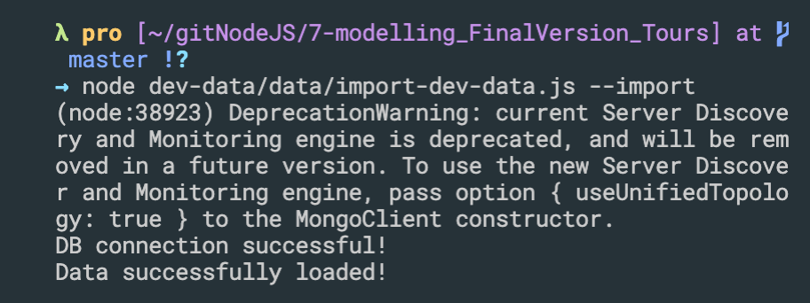
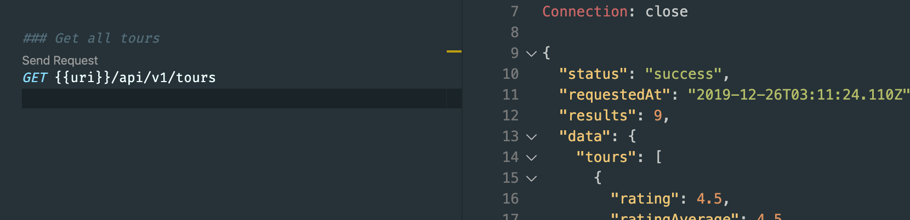

## final version for creating model
- update tourModel.js
```js
const mongoose = require('mongoose');
const tourSchema = new mongoose.Schema({
    name: {
        type: String,
        required: [true, 'A tour must have a nme'],
        unique: true, //we can't have tour documents with the same name
        trim: true
    },
    duration: {
        type: Number,
        required: [true, 'A tour must have a duration']
    },
    maxGroupSize: {
        type: Number,
        required: [true, 'A tour must have a group size']
    },
    difficulty: {
        type: String,
        required: [true, 'A tour must have a difficulty']
    },
    rating: {
        type: Number,
        default: 4.5
    },
    ratingAverage: {
        type: Number,
        default: 4.5
    },
    ratingQuantity: {
        type: Number,
        default: 0
    },
    price: {
        type: Number,
        required: [true, 'A tour must have a price']
    },
    priceDiscount: Number,
    summary: {
        type: String,
        trim: true,
        required: [true, 'A tour must have a description']
    },
    description: {
        type: String,
        trim: true
    },
    imageCover: {
        type: String,
        required: [true, 'A tour must have a cover image']
    },
    images: [String],
    createdAt: {
        type: Date,
        default: Date.now()
    },
    startDates: [Date]
});
const Tour = mongoose.model('Tour', tourSchema);
module.exports = Tour;
```


---
- It's basically there to ensure the strings you save through the schema are properly trimmed. If you add { type: String, trim: true } to a field in your schema, then trying to save strings like "  hello", or "hello  ", or "  hello  ", would end up being saved as "hello" in Mongo - i.e. white spaces will be trimmed.
---

## Importing Development Data

- create import-dev-data.js
```js
//Importing Development Data
const fs = require('fs');
const mongoose = require('mongoose');
const dotenv = require('dotenv');
const Tour = require('./../../models/tourModel');

dotenv.config({ path: './config.env' });

const DB = process.env.DATABASE.replace('<PASSWORD>', process.env.DATABASE_PASSWORD);

mongoose.connect(DB, {
    useNewUrlParser: true,
    useCreateIndex: true,
    useFindAndModify: false
}).then(() => {
    console.log('DB connection successful!');
})

//READ JSON FILE
const tours = JSON.parse(fs.readFileSync(`${__dirname}/tours-simple.json`, 'utf-8'));

//IMPORT DATA INTO DB
const importData = async () => {
    try {
        await Tour.create(tours);
        console.log('Data successfully loaded!');
    } catch (err) {
        console.log(err);
    }
};

//DELETE ALL DATA FROM COLLECTION
const deleteData = async () => {
    try {
        await Tour.deleteMany();
        console.log('Data successfully loaded!');
    } catch (err) {
        console.log(err);
    }
}

console.log(process.argv);
```

-  The first element will be process.execPath. See process.argv0 if access to the original value of argv[0] is needed. 
-  The second element will be the path to the JavaScript file being executed. 
---
-
- update import-dev-data.js
```js
//Importing Development Data
const fs = require('fs');
const mongoose = require('mongoose');
const dotenv = require('dotenv');
const Tour = require('./../../models/tourModel');

dotenv.config({ path: './config.env' });

const DB = process.env.DATABASE.replace('<PASSWORD>', process.env.DATABASE_PASSWORD);

mongoose.connect(DB, {
    useNewUrlParser: true,
    useCreateIndex: true,
    useFindAndModify: false
}).then(() => {
    console.log('DB connection successful!');
})

//READ JSON FILE
const tours = JSON.parse(fs.readFileSync(`${__dirname}/tours-simple.json`, 'utf-8'));

//IMPORT DATA INTO DB
const importData = async () => {
    try {
        await Tour.create(tours);
        console.log('Data successfully loaded!');
        process.exit();
    } catch (err) {
        console.log(err);
    }
};

//DELETE ALL DATA FROM COLLECTION
const deleteData = async () => {
    try {
        await Tour.deleteMany();
        console.log('Data successfully loaded!');
        process.exit();
    } catch (err) {
        console.log(err);
    }
}

if (process.argv[2] === '--import') {
    importData();
} else if (process.argv[2] === '--delete') {
    deleteData();
}
```

-
- now try to import


- and then, added these data into mongoDB
---


## Making the API Better: Filtering


