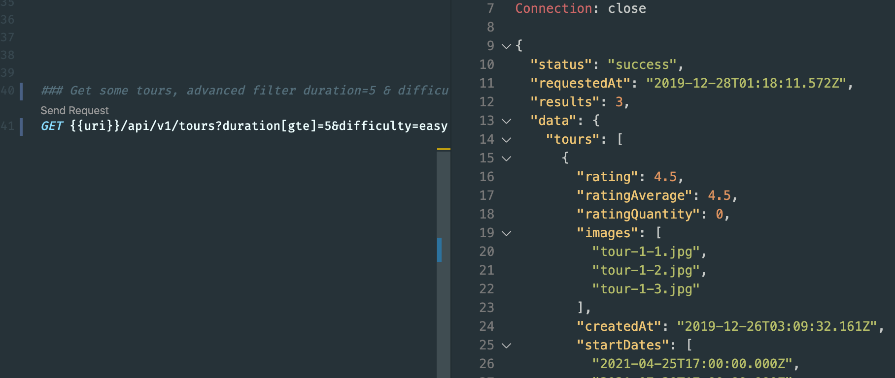
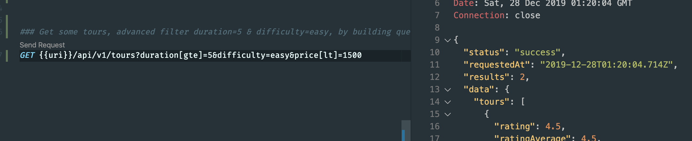
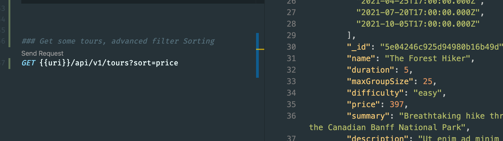

## Making the API Better: Advanced Filtering
- updte tourController.js
```js
//Making the API Better: Advanced Filtering
const Tour = require('./../models/tourModel');

exports.getAllTours = async (req, res) => {
    try {
        //BUILD QUERY
        //1) Filtering
        const queryObj = { ...req.query };
        // console.log(queryObj);//to see what query string is 
        const excludeFields = ['page', 'sort', 'limit', 'fields'];
        excludeFields.forEach(el => delete queryObj[el]);

        //2) Advanced filtering
        let queryStr = JSON.stringify(queryObj); //here can't use const, since we need it mutate
        // console.log(queryStr);

        queryStr = queryStr.replace(/\b(gte|gt|lte|lt)\b/g, (match) => `$${match}`);
        /**
         *  g flag, means Global, replace all matches, not just the first one
         */
        console.log(queryStr);
        console.log(JSON.parse(queryStr));

        // { difficulty: 'easy', duration: { $gte: 5 } }
        // { difficulty: 'easy', duration: { gte: '5'} }
        //gte, gt, lte, lt

        const query = Tour.find(JSON.parse(queryStr));

        //EXECUTE QUERY
        const tours = await query;

        //SEND RESPONSE
        res.status(200).json({
            status: 'success',
            requestedAt: req.requestTime,
            results: tours.length,
            data: {
                tours: tours
            }
        });
    } catch (error) {
        res.status(404).json({
            status: 'fail',
            message: error
        });
    }
};

exports.getTour = async (req, res) => {
    try {
        const tour = await Tour.findById(req.params.id);
        //Tour.findOne({ _id: req.params.id})

        res.status(200).json({
            status: 'success',
            data: {
                tour
            }
        });
    } catch (err) {
        res.status(404).json({
            status: 'fail',
            message: error
        });
    }
};

exports.createTour = async (req, res) => {
    try {
        // //the first way to create a new document, and save() return a promise
        // const newTours = new Tour({})
        // newTour.save()

        //2nd way to create a new document, create() return a promise as well as save()
        const newTour = await Tour.create(req.body);
        //if use async, we don't neet to use .then()


        res.status(201).json({
            status: 'success',
            data: {
                tour: newTour
            }
        });
    } catch (err) {
        res.status(400).json({
            status: 'fail',
            message: err
        })
    }
};

exports.updateTour = async (req, res) => {
    try {
        const tour = await Tour.findByIdAndUpdate(req.params.id, req.body, {
            new: true,
            runValidators: true
        })
        res.status(200).json({
            status: 'success',
            data: {
                tour
            }
        });
    } catch (err) {
        res.status(400).json({
            status: 'fail',
            message: err
        })
    }
};

exports.deleteTour = async (req, res) => {
    try {
        await Tour.findByIdAndDelete(req.params.id);
        res.status(204).json({//204 means not content
            status: 'success',
            data: null
        });
    } catch (err) {
        res.status(400).json({
            status: 'fail',
            message: err
        })
    }
};
```
- try to send GET request

- we see there are three results

- then, we try to see satisfy condition price<= 1500

- only two results

---

## Making the API Better: Sorting
- tourController.js
```js
//Making the API Better: Sorting
const Tour = require('./../models/tourModel');

exports.getAllTours = async (req, res) => {
    try {
        console.log(req.query);

        //BUILD QUERY
        //1A) Filtering
        const queryObj = { ...req.query };
        // console.log(queryObj);//to see what query string is 
        const excludeFields = ['page', 'sort', 'limit', 'fields'];
        excludeFields.forEach(el => delete queryObj[el]);

        //1B) Advanced filtering
        let queryStr = JSON.stringify(queryObj); //here can't use const, since we need it mutate

        queryStr = queryStr.replace(/\b(gte|gt|lte|lt)\b/g, (match) => `$${match}`);
        /**
         *  g flag, means Global, replace all matches, not just the first one
         */
        console.log(queryStr);
        console.log(JSON.parse(queryStr));

        // { difficulty: 'easy', duration: { $gte: 5 } }
        // { difficulty: 'easy', duration: { gte: '5'} }
        //gte, gt, lte, lt

        let query = Tour.find(JSON.parse(queryStr));

        //2) Sorting
        if (req.query.sort) {
            query = query.sort(req.query.sort)
        }

        //EXECUTE QUERY
        const tours = await query;

        //SEND RESPONSE
        res.status(200).json({
            status: 'success',
            requestedAt: req.requestTime,
            results: tours.length,
            data: {
                tours: tours
            }
        });
    } catch (error) {
        res.status(404).json({
            status: 'fail',
            message: error
        });
    }
};

exports.getTour = async (req, res) => {
    try {
        const tour = await Tour.findById(req.params.id);
        //Tour.findOne({ _id: req.params.id})

        res.status(200).json({
            status: 'success',
            data: {
                tour
            }
        });
    } catch (err) {
        res.status(404).json({
            status: 'fail',
            message: error
        });
    }
};

exports.createTour = async (req, res) => {
    try {
        // //the first way to create a new document, and save() return a promise
        // const newTours = new Tour({})
        // newTour.save()

        //2nd way to create a new document, create() return a promise as well as save()
        const newTour = await Tour.create(req.body);
        //if use async, we don't neet to use .then()


        res.status(201).json({
            status: 'success',
            data: {
                tour: newTour
            }
        });
    } catch (err) {
        res.status(400).json({
            status: 'fail',
            message: err
        })
    }
};

exports.updateTour = async (req, res) => {
    try {
        const tour = await Tour.findByIdAndUpdate(req.params.id, req.body, {
            new: true,
            runValidators: true
        })
        res.status(200).json({
            status: 'success',
            data: {
                tour
            }
        });
    } catch (err) {
        res.status(400).json({
            status: 'fail',
            message: err
        })
    }
};

exports.deleteTour = async (req, res) => {
    try {
        await Tour.findByIdAndDelete(req.params.id);
        res.status(204).json({//204 means not content
            status: 'success',
            data: null
        });
    } catch (err) {
        res.status(400).json({
            status: 'fail',
            message: err
        })
    }
};
```
- now let's send http request for sorting

- now the price sorting by ascending order
-
- update tourController.js
```js
//Making the API Better: Sorting
const Tour = require('./../models/tourModel');

exports.getAllTours = async (req, res) => {
    try {
        console.log(req.query);

        //BUILD QUERY
        //1A) Filtering
        const queryObj = { ...req.query };
        // console.log(queryObj);//to see what query string is 
        const excludeFields = ['page', 'sort', 'limit', 'fields'];
        excludeFields.forEach(el => delete queryObj[el]);

        //1B) Advanced filtering
        let queryStr = JSON.stringify(queryObj); //here can't use const, since we need it mutate

        queryStr = queryStr.replace(/\b(gte|gt|lte|lt)\b/g, (match) => `$${match}`);
        /**
         *  g flag, means Global, replace all matches, not just the first one
         */
        console.log(queryStr);
        console.log(JSON.parse(queryStr));

        // { difficulty: 'easy', duration: { $gte: 5 } }
        // { difficulty: 'easy', duration: { gte: '5'} }
        //gte, gt, lte, lt

        let query = Tour.find(JSON.parse(queryStr));

        //2) Sorting
        if (req.query.sort) {
            const sortBy = req.query.sort.split(',').join(' ');
            console.log(sortBy);
            query = query.sort(sortBy);
        } else {
            query = query.sort('-createAt');
        }

        //EXECUTE QUERY
        const tours = await query;

        //SEND RESPONSE
        res.status(200).json({
            status: 'success',
            requestedAt: req.requestTime,
            results: tours.length,
            data: {
                tours: tours
            }
        });
    } catch (error) {
        res.status(404).json({
            status: 'fail',
            message: error
        });
    }
};

exports.getTour = async (req, res) => {
    try {
        const tour = await Tour.findById(req.params.id);
        //Tour.findOne({ _id: req.params.id})

        res.status(200).json({
            status: 'success',
            data: {
                tour
            }
        });
    } catch (err) {
        res.status(404).json({
            status: 'fail',
            message: error
        });
    }
};

exports.createTour = async (req, res) => {
    try {
        // //the first way to create a new document, and save() return a promise
        // const newTours = new Tour({})
        // newTour.save()

        //2nd way to create a new document, create() return a promise as well as save()
        const newTour = await Tour.create(req.body);
        //if use async, we don't neet to use .then()


        res.status(201).json({
            status: 'success',
            data: {
                tour: newTour
            }
        });
    } catch (err) {
        res.status(400).json({
            status: 'fail',
            message: err
        })
    }
};

exports.updateTour = async (req, res) => {
    try {
        const tour = await Tour.findByIdAndUpdate(req.params.id, req.body, {
            new: true,
            runValidators: true
        })
        res.status(200).json({
            status: 'success',
            data: {
                tour
            }
        });
    } catch (err) {
        res.status(400).json({
            status: 'fail',
            message: err
        })
    }
};

exports.deleteTour = async (req, res) => {
    try {
        await Tour.findByIdAndDelete(req.params.id);
        res.status(204).json({//204 means not content
            status: 'success',
            data: null
        });
    } catch (err) {
        res.status(400).json({
            status: 'fail',
            message: err
        })
    }
};
```
---


