### 

```js
//Creating a simple web server
const fs = require('fs');   //fs module stands for file system
                            //read from file
const http = require('http'); 

// SERVER
const server = http.createServer((req, res) => {
    res.end('Hello from the server!')
})

server.listen(8000, '127.0.0.1', () => {
    console.log('Listening to requests on port 8000');
})
```
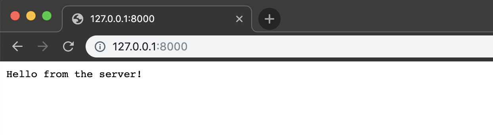
---

---
### Routing

```js
//routing
const fs = require('fs')
const http = require('http')
const url = require('url')

const server = http.createServer((req, res) => {
    console.log(req.url)
    res.end('Hello from the server!')
})

server.listen(8000, '127.0.0.1', () => {
    console.log('Listening to requests on port 8000');
})
```

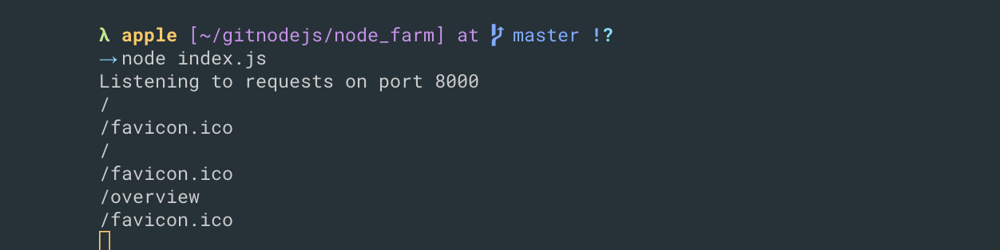
---
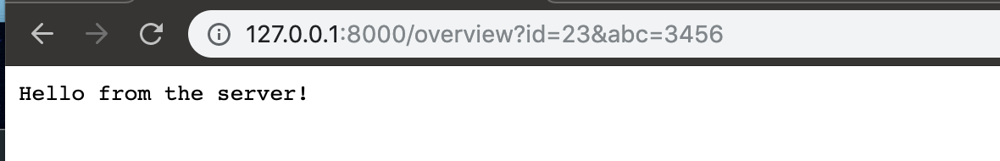
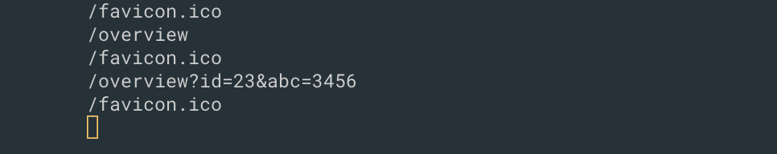
---

---
- updating
```js
//routing
const fs = require('fs')
const http = require('http')
const url = require('url')

const server = http.createServer((req, res) => {
    const pathName = req.url;

    if (pathName === '/' || pathName === '/overview') {
        res.end('This is the OVERVIEW')
    } else if (pathName === '/product') {
        res.end('This is the PRODUCT')
    }

    res.end('Hello from the server!')
})

server.listen(8000, '127.0.0.1', () => {
    console.log('Listening to requests on port 8000');
})
```
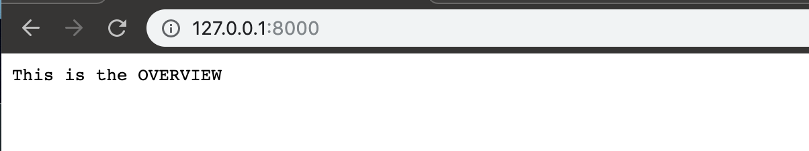
---
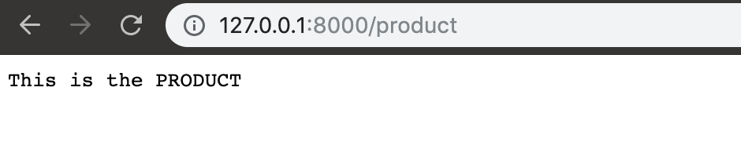
---

---
- if we comment this line 
- `res.end('Hello from the server!')`
```js
const server = http.createServer((req, res) => {
    const pathName = req.url;

    if (pathName === '/' || pathName === '/overview') {
        res.end('This is the OVERVIEW')
    } else if (pathName === '/product') {
        res.end('This is the PRODUCT')
    }

    // res.end('Hello from the server!')
})

server.listen(8000, '127.0.0.1', () => {
    console.log('Listening to requests on port 8000');
})
```
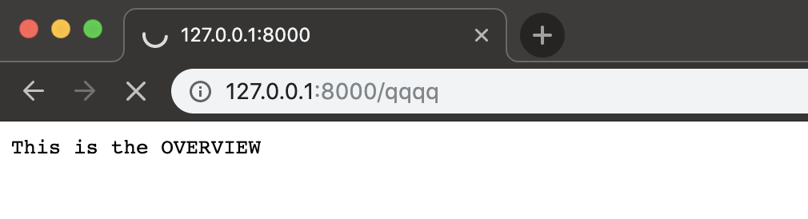
- it doesn't know what are u doing

---
- update
```js
const server = http.createServer((req, res) => {
    const pathName = req.url;

    if (pathName === '/' || pathName === '/overview') {
        res.end('This is the OVERVIEW')
    } else if (pathName === '/product') {
        res.end('This is the PRODUCT')
    } else {
        res.end('Page not found!')
    }
})

server.listen(8000, '127.0.0.1', () => {
    console.log('Listening to requests on port 8000');
})
```
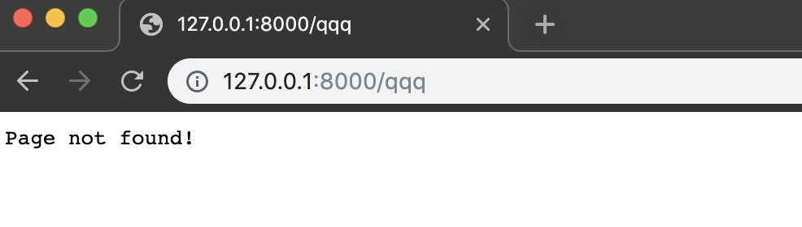
---

- update
```js
const server = http.createServer((req, res) => {
    const pathName = req.url;

    if (pathName === '/' || pathName === '/overview') {
        res.end('This is the OVERVIEW')
    } else if (pathName === '/product') {
        res.end('This is the PRODUCT')
    } else {
        res.writeHead(404)
        res.end('Page not found!')
    }
})
```
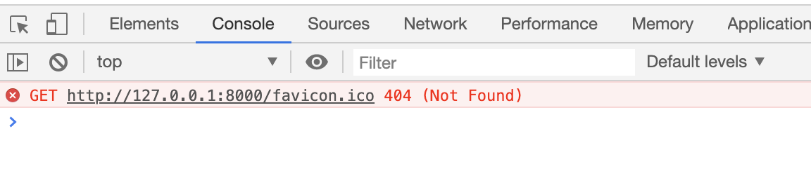
---
- open network
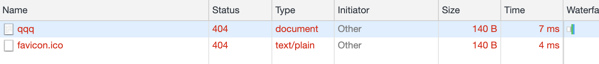
---

---
- update
```js
const server = http.createServer((req, res) => {
    const pathName = req.url;

    if (pathName === '/' || pathName === '/overview') {
        res.end('This is the OVERVIEW')
    } else if (pathName === '/product') {
        res.end('This is the PRODUCT')
    } else {
        res.writeHead(404, {
            'Content-type': 'text/html',
            'my-own-header': 'hello-world'
        })
        res.end('<h1>Page not found!</h1>')
    }
})

server.listen(8000, '127.0.0.1', () => {
    console.log('Listening to requests on port 8000');
})
```
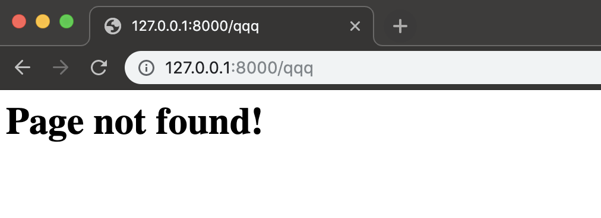
---
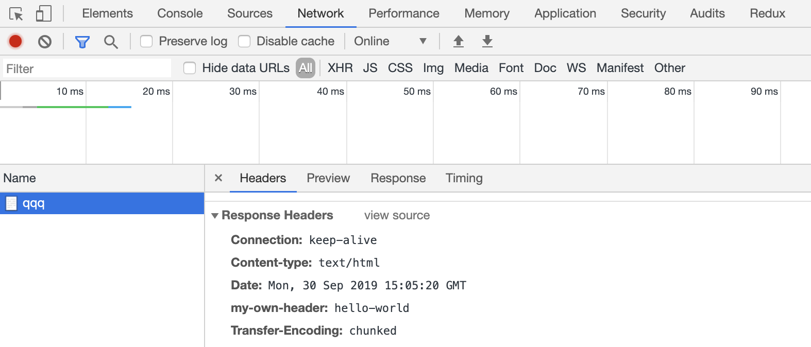
---
