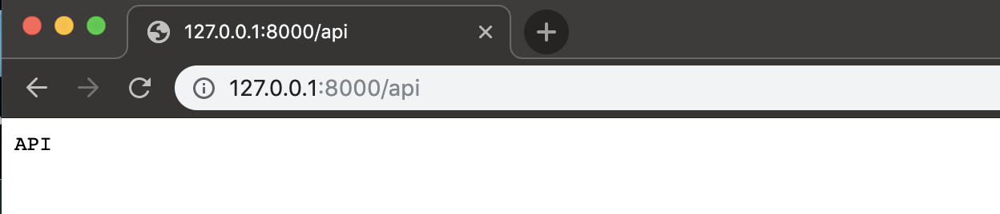
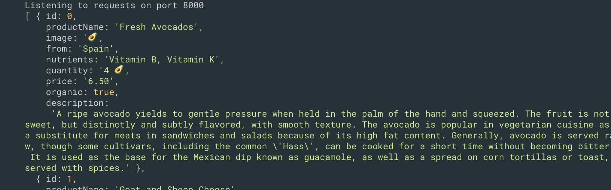
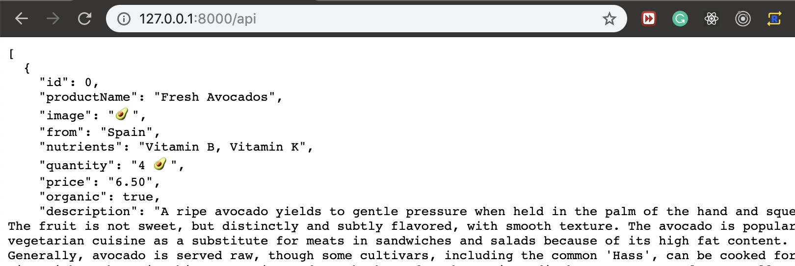
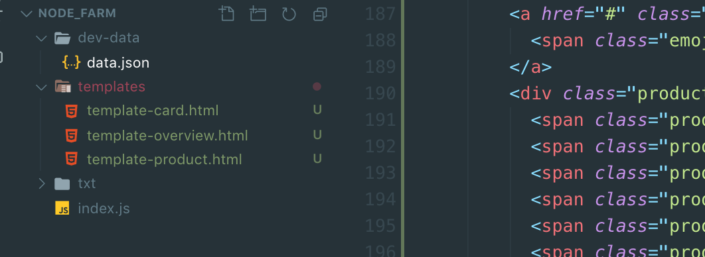
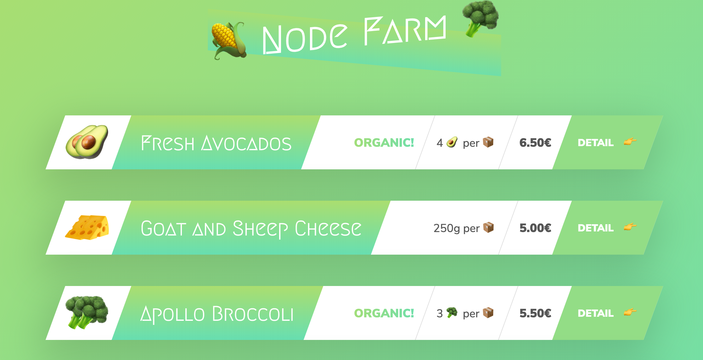

### build a very simple API

- index.js
```js
//Building a Simple API
const fs = require('fs')
const http = require('http')
const url = require('url')

const server = http.createServer((req, res) => {
    const pathName = req.url;

    if (pathName === '/' || pathName === '/overview') {
        res.end('This is the OVERVIEW')
    } else if (pathName === '/product') {
        res.end('This is the PRODUCT')
    } else if (pathName === '/api') {

        fs.readFile(`${__dirname}/dev-data/data.json`, 'utf-8', (err, data) => {
            const productData = JSON.parse(data)
            console.log(productData)
        })

        res.end('API')
    }
    else {
        res.writeHead(404, {
            'Content-type': 'text/html',
            'my-own-header': 'hello-world'
        })
        res.end('<h1>Page not found!</h1>')
    }
})

server.listen(8000, '127.0.0.1', () => {
    console.log('Listening to requests on port 8000');
})
```

---

---

---
- updating
```js
//Building a Simple API
const fs = require('fs')
const http = require('http')
const url = require('url')

const server = http.createServer((req, res) => {
    const pathName = req.url;

    if (pathName === '/' || pathName === '/overview') {
        res.end('This is the OVERVIEW')
    } else if (pathName === '/product') {
        res.end('This is the PRODUCT')
    } else if (pathName === '/api') {

        fs.readFile(`${__dirname}/dev-data/data.json`, 'utf-8', (err, data) => {
            const productData = JSON.parse(data)
            res.writeHead(200, {
                'Content-type': 'application/json'
            })
            res.end(data)
        })
    }
    else {
        res.writeHead(404, {
            'Content-type': 'text/html',
            'my-own-header': 'hello-world'
        })
        res.end('<h1>Page not found!</h1>')
    }
})

server.listen(8000, '127.0.0.1', () => {
    console.log('Listening to requests on port 8000');
})
```

---

---
- version 2
```js
//build simple api, version 2
const fs = require('fs')
const http = require('http')
const url = require('url')

const data = fs.readFileSync(`${__dirname}/dev-data/data.json`, 'utf-8')
const dataObj = JSON.parse(data)

const server = http.createServer((req, res) => {
    const pathName = req.url;

    if (pathName === '/' || pathName === '/overview') {
        res.end('This is the OVERVIEW')
    } else if (pathName === '/product') {
        res.end('This is the PRODUCT')
    } else if (pathName === '/api') {

        res.writeHead(200, { 'Content-type': 'application/json' })
        res.end(data)
    }
    else {
        res.writeHead(404, {
            'Content-type': 'text/html',
            'my-own-header': 'hello-world'
        })
        res.end('<h1>Page not found!</h1>')
    }
})

server.listen(8000, '127.0.0.1', () => {
    console.log('Listening to requests on port 8000');
})
```
- this still work, the same result.

---

### HTML Templating: Building the Templates (make a static html to be dynamic)

- product.html
```html
<body>
    <div class="container">
      <h1>🌽 Node Farm 🥦</h1>

      <figure class="product">
        <div class="product__organic"><h5>Organic</h5></div>
        <a href="#" class="product__back">
          <span class="emoji-left">👈</span>Back
        </a>
        <div class="product__hero">
          <span class="product__emoji product__emoji--1">🥑</span>
          <span class="product__emoji product__emoji--2">🥑</span>
          <span class="product__emoji product__emoji--3">🥑</span>
          <span class="product__emoji product__emoji--4">🥑</span>
          <span class="product__emoji product__emoji--5">🥑</span>
          <span class="product__emoji product__emoji--6">🥑</span>
          <span class="product__emoji product__emoji--7">🥑</span>
          <span class="product__emoji product__emoji--8">🥑</span>
          <span class="product__emoji product__emoji--9">🥑</span>
        </div>
        <h2 class="product__name">Fresh Avocados</h2>
        <div class="product__details">
          <p><span class="emoji-left">🌍</span> From Portugal</p>
          <p><span class="emoji-left">❤️</span> Vitamin B, Vitamin K</p>
          <p><span class="emoji-left">📦</span> 4 🥑</p>
          <p><span class="emoji-left">🏷</span> 6.50€</p>
        </div>
  
        <a href="#" class="product__link">
          <span class="emoji-left">🛒</span>
          <span>Add to shopping card (6.50€)</span>
        </a>
  
        <p class="product__description">
          A ripe avocado yields to gentle pressure when held in the palm of the
          hand and squeezed. The fruit is not sweet, but distinctly and subtly
          flavored, with smooth texture. The avocado is popular in vegetarian
          cuisine as a substitute for meats in sandwiches and salads because of
          its high fat content. Generally, avocado is served raw, though some
          cultivars, including the common 'Hass', can be cooked for a short time
          without becoming bitter. It is used as the base for the Mexican dip
          known as guacamole, as well as a spread on corn tortillas or toast,
          served with spices.
        </p>
      </figure>
      
    </div>
  </body>
```
- now we replace that placeholder, with real piece of data

```html
 <body>
    <div class="container">
      <h1>🌽 Node Farm 🥦</h1>

      <figure class="product">
        <div class="product__organic "><h5>Organic</h5></div>
        <a href="#" class="product__back">
          <span class="emoji-left">👈</span>Back
        </a>
        <div class="product__hero">
          <span class="product__emoji product__emoji--1"></span>
          <span class="product__emoji product__emoji--2"></span>
          <span class="product__emoji product__emoji--3"></span>
          <span class="product__emoji product__emoji--4"></span>
          <span class="product__emoji product__emoji--5"></span>
          <span class="product__emoji product__emoji--6"></span>
          <span class="product__emoji product__emoji--7"></span>
          <span class="product__emoji product__emoji--8"></span>
          <span class="product__emoji product__emoji--9"></span>
        </div>
        <h2 class="product__name"></h2>
        <div class="product__details">
          <p><span class="emoji-left">🌍</span>From  </p>
          <p><span class="emoji-left">❤️</span> </p>
          <p><span class="emoji-left">📦</span></p>
          <p><span class="emoji-left">🏷</span> </p>
        </div>
  
        <a href="#" class="product__link">
          <span class="emoji-left">🛒</span>
          <span>Add to shopping card (€)</span>
        </a>
  
        <p class="product__description">
          
        </p>
      </figure>
      
    </div>
  </body>
```

---
- now we change the .html name, and create a new template-card.html

---

- delete <figure></figure> from teamplate-overview.html
- replace template-overview.html with:
```html
  <body>
    <div class="container">
      <h1>🌽 Node Farm 🥦</h1>

      <div class="cards-container">
       
      </div>
    </div>
  </body>
</html>
```
- updating template-card.html
```html
<figure class="card">
    <div class="card__emoji"></div>
    <div class="card__title-box">
      <h2 class="card__title"></h2>
    </div>

    <div class="card__details">
      <div class="card__detail-box ">
        <h6 class="card__detail card__detail--organic">Organic!</h6>
      </div>

      <div class="card__detail-box ">
        <h6 class="card__detail"> per 📦</h6>
      </div>

      <div class="card__detail-box">
        <h6 class="card__detail card__detail--price">€</h6>
      </div>
    </div>

    <a class="card__link" href="/product?id=">
      <span>Detail <i class="emoji-right">👉</i></span>
    </a>
  </figure>
```
---
### HTML Templating: Filling the Templates
- update index.js
```js
//Filling the Templates
const fs = require('fs')
const http = require('http')
const url = require('url')

const replaceTemplate = (temp, product) => {
    let output = temp.replace(//g, product.productName);
    output = output.replace(//g, product.image);
    output = output.replace(//g, product.price);
    output = output.replace(//g, product.from);
    output = output.replace(//g, product.nutrients);
    output = output.replace(//g, product.quantity);
    output = output.replace(//g, product.id);
    output = output.replace(//g, product.image);

    if (!product.organic) {
        output = output.replace(//g, 'not-organic')
    }

    return output;
}

const tempOverview = fs.readFileSync(`${__dirname}/templates/template-overview.html`, 'utf-8')
const tempCard = fs.readFileSync(`${__dirname}/templates/template-card.html`, 'utf-8')
const tempProduct = fs.readFileSync(`${__dirname}/templates/template-product.html`, 'utf-8')

const data = fs.readFileSync(`${__dirname}/dev-data/data.json`, 'utf-8')
const dataObj = JSON.parse(data)

const server = http.createServer((req, res) => {
    const pathName = req.url;

    //Overview page
    if (pathName === '/' || pathName === '/overview') {
        res.writeHead(200, { 'Content-type': 'text/html' })

        const cardsHtml = dataObj.map(el => replaceTemplate(tempCard, el)).join('')
        const output = tempOverview.replace('', cardsHtml)
        res.end(output);

        //Product page
    } else if (pathName === '/product') {
        res.end('This is the PRODUCT')

        //API     
    } else if (pathName === '/api') {
        res.writeHead(200, { 'Content-type': 'text/html' })
        res.end(data)

        //Not found
    }
    else {
        res.writeHead(404, {
            'Content-type': 'text/html',
            'my-own-header': 'hello-world'
        })
        res.end('<h1>Page not found!</h1>')
    }
})

server.listen(8000, '127.0.0.1', () => {
    console.log('Listening to requests on port 8000');
})
```

---


