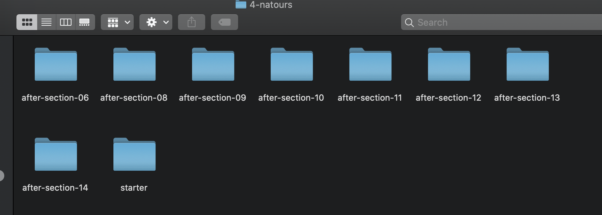
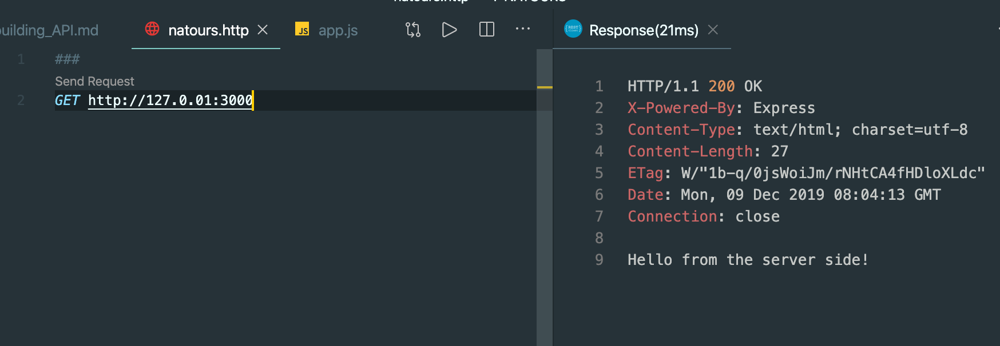

### Installing Postman
- install Postman for mac

- test: dog.ceo

- import a starter project 

- cd 4-NATOURS
- `npm init`

- we install express@4
- `npm i express@4`

- create an app.js

- 这里由于我已经装了 REST Client, 所以暂时不需要Postman, 个人感觉REST Client 比较好用
- create natours.http

