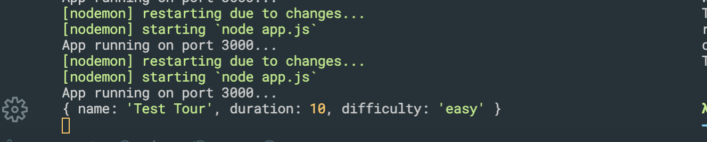

### Installing Postman
- install Postman for mac

- test: dog.ceo


- import a starter project 


- cd 4-NATOURS
- `npm init`


- we install express@4
- `npm i express@4`


- create an app.js


- 这里由于我已经装了 REST Client, 所以暂时不需要Postman, 个人感觉REST Client 比较好用
- create natours.http
- app.js
```js
const express = require('express');

const app = express();

app.get('/', (req, res) => {
    res.status(200).send('Hello from the server side!');
})

const port = 3000;
app.listen(port, () => {
    console.log(`App running on port ${port}...`);
});
```


- try to use json
```js
const express = require('express');

const app = express();

//try to use json
app.get('/', (req, res) => {
    res.status(200).json({
        message: 'Hello from the server side!',
        app: 'Natours'
    });
})

const port = 3000;
app.listen(port, () => {
    console.log(`App running on port ${port}...`);
});
```

- if we change the code to 404
```js
app.get('/', (req, res) => {
    res.status(404).json({
        message: 'Hello from the server side!',
        app: 'Natours'
    });
})
```


- now try to use Post method
```js
app.post('/', (req, res) => {
    res.send('You can post to this endpoint...');
})
```

---


### APIS and RESTful API Design
#### Application Programming Interface: a piece of software that can be used by another piece of software, in order to allow applications to talk to each other


### Starting Our API: Handing GET Requests
- we have json data in folder data
- so we can read data from .json file
```js
const fs = require('fs');
const express = require('express');

const app = express();

const tours = JSON.parse(
    fs.readFileSync(`${__dirname}/dev-data/data/tours-simple.json`)
);

//try to use json
app.get('/api/v1/tours', (req, res) => {
    res.status(200).json({
        status: 'success',
        data: {
            tours: tours
        }
    })
})


const port = 3000;
app.listen(port, () => {
    console.log(`App running on port ${port}...`);
});
```

---


```js
//try to use json
app.get('/api/v1/tours', (req, res) => {
    res.status(200).json({
        status: 'success',
        results: tours.length,
        data: {
            tours: tours
        }
    })
})
```
- we have 9 results.

- but this is file-based API
---


### Handling POST Requests
```js
//Handling POST method
const fs = require('fs');
const express = require('express');

const app = express();
app.use(express.json()); //middleware, 中间件

const tours = JSON.parse(
    fs.readFileSync(`${__dirname}/dev-data/data/tours-simple.json`)
);

//try to use json
app.get('/api/v1/tours', (req, res) => {
    res.status(200).json({
        status: 'success',
        results: tours.length,
        data: {
            tours: tours
        }
    })
})

app.post('/api/v1/tours', (req, res) => {
    console.log(req.body);
    res.send('Done');
})

const port = 3000;
app.listen(port, () => {
    console.log(`App running on port ${port}...`);
});
```

- click Collections, + New Collection
- click save


- 这里我们使用Postman
- POST method

- click save


- use POST
- choose body
- click raw
```json
{
	"name": "Test Tour",
	"duration": 10,
	"difficulty": "easy"
}
```

- since our POST method, `console.log(req.body)`

- remember, when I click `send` on Postman, then our terminal console 
```js
[nodemon] restarting due to changes...
[nodemon] starting `node app.js`
App running on port 3000...
{ name: 'Test Tour', duration: 10, difficulty: 'easy' }
```
- because I send API to our node.js server
- if we don't use `app.use(express.json()); //middleware, 中间件`
- we can't receive json data
- let's do it
```js
//Handling POST method
const fs = require('fs');
const express = require('express');

const app = express();
// app.use(express.json()); //middleware, 中间件

const tours = JSON.parse(
    fs.readFileSync(`${__dirname}/dev-data/data/tours-simple.json`)
);
```

- for here, we don't have middleware, so we get `undefined`
- if we use vscode Colonize plugin, we get the same result


- now try to add a new object with json string
```js
//Handling POST method
const fs = require('fs');
const express = require('express');

const app = express();
app.use(express.json()); //middleware, 中间件

const tours = JSON.parse(
    fs.readFileSync(`${__dirname}/dev-data/data/tours-simple.json`)
);

//try to use json
app.get('/api/v1/tours', (req, res) => {
    res.status(200).json({
        status: 'success',
        results: tours.length,
        data: {
            tours: tours
        }
    })
})

app.post('/api/v1/tours', (req, res) => {
    // console.log(req.body);

    const newId = tours[tours.length - 1].id + 1;
    const newTour = Object.assign({ id: newId }, req.body);

    tours.push(newTour);
    fs.writeFile(`${__dirname}/dev-data/data/tours-simple.json`, JSON.stringify(tours),
        err => {
            res.status(201).json({
                status: 'success',
                data: {
                    tour: newTour
                }
            });
        }
    )
})

const port = 3000;
app.listen(port, () => {
    console.log(`App running on port ${port}...`);
});
```

- so we send the request
- we try to send twice

- id 9, id 10, that means we have sent twice

- the result is 11, since `results: tours.length`
