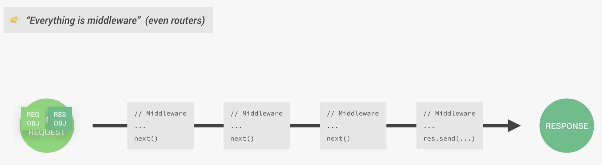

## Handing PATCH Requests (express)
1. The HTTP `PATCH` request method applies partial modifications to a resource.(部分修改)
2. The HTTP `PUT` method only allows complete replacement of a document.(整体覆盖) Unlike `PUT`, `PATCH` is not idempotent, meaning successive identical patch requests may have different effects. However, it is possible to issue PATCH requests in such a way as to be idempotent.

- update app.js
```js
app.patch('/api/v1/tours/:id', (req, res) => {
    if (req.params.id * 1 > tours.length) {
        return res.status(404).json({
            status: 'fail',
            message: 'Invalid ID'
        });
    }
    res.status(200).json({
        status: 'success',
        data: {
            tour: '<Updated tour here...>'
        }
    });
});
```

---


## Handing DELETE Requests (express)
- update app.js
```js
app.delete('/api/v1/tours/:id', (req, res) => {
    if (req.params.id * 1 > tours.length) {
        return res.status(404).json({
            status: 'fail',
            message: 'Invalid ID'
        });
    }
    res.status(204).json({//204 means not content
        status: 'success',
        data: null
    });
});
```

---

## Refactoring Our Routes
- update app.js
```js
//Refactoring Our Routes
const fs = require('fs');
const express = require('express');

const app = express();
app.use(express.json()); //middleware, 中间件

const tours = JSON.parse(
    fs.readFileSync(`${__dirname}/dev-data/data/tours-simple.json`)
);

const getAllTours = (req, res) => {
    res.status(200).json({
        status: 'success',
        results: tours.length,
        data: {
            tours: tours
        }
    });
};

const getTour = (req, res) => {
    console.log(req.params);
    console.log(req.params.id);
    console.log(typeof (req.params.id));

    const id = req.params.id * 1;
    console.log("after converting..." + typeof (id));

    const tour = tours.find(el => (el.id === id));
    if (!tour) {
        return res.status(404).json({
            status: 'fail',
            message: 'Invalid ID'
        });
    }
    res.status(200).json({
        status: 'success',
        data: {
            tour
        }
    });
};

const createTour = (req, res) => {
    // console.log(req.body);

    const newId = tours[tours.length - 1].id + 1;
    const newTour = Object.assign({ id: newId }, req.body);

    tours.push(newTour);
    fs.writeFile(
        `${__dirname}/dev-data/data/tours-simple.json`,
        JSON.stringify(tours),
        err => {
            res.status(201).json({
                status: 'success',
                data: {
                    tour: newTour
                }
            });
        }
    );
};

const updateTour = (req, res) => {
    if (req.params.id * 1 > tours.length) {
        return res.status(404).json({
            status: 'fail',
            message: 'Invalid ID'
        });
    }
    res.status(200).json({
        status: 'success',
        data: {
            tour: '<Updated tour here...>'
        }
    });
};

const deleteTour = (req, res) => {
    if (req.params.id * 1 > tours.length) {
        return res.status(404).json({
            status: 'fail',
            message: 'Invalid ID'
        });
    }
    res.status(204).json({//204 means not content
        status: 'success',
        data: null
    });
};

//try to use json
app.get('/api/v1/tours', getAllTours);
app.get('/api/v1/tours/:id', getTour);
app.post('/api/v1/tours', createTour);
app.patch('/api/v1/tours/:id', updateTour);
app.delete('/api/v1/tours/:id', deleteTour);

const port = 3000;
app.listen(port, () => {
    console.log(`App running on port ${port}...`);
    console.log(`${__dirname}`)
});
```
- still can imporve our codes
```js
/*try to use json*/

// app.get('/api/v1/tours', getAllTours);
// app.post('/api/v1/tours', createTour);
// app.get('/api/v1/tours/:id', getTour);
// app.patch('/api/v1/tours/:id', updateTour);
// app.delete('/api/v1/tours/:id', deleteTour);

app.route('/api/v1/tours')
    .get(getAllTours)
    .post(createTour);

app.route('/api/v1/tours/:id')
    .get(getTour)
    .patch(updateTour)
    .delete(deleteTour);
```
---

## Middleware and the Request-Response Cycle


---


---


---

---


## Create Our Own Middleware
- update app.js
```js
//Create Our Own Middleware
const fs = require('fs');
const express = require('express');

const app = express();
app.use(express.json()); //middleware, 中间件

app.use((req, res, next) => { //middleware
    console.log('Hello from the middleware 🐳');
    next();
});


const tours = JSON.parse(
    fs.readFileSync(`${__dirname}/dev-data/data/tours-simple.json`)
);

const getAllTours = (req, res) => {
    res.status(200).json({
        status: 'success',
        results: tours.length,
        data: {
            tours: tours
        }
    });
};

const getTour = (req, res) => {
    console.log(req.params);
    console.log(req.params.id);
    console.log(typeof (req.params.id));

    const id = req.params.id * 1;
    console.log("after converting..." + typeof (id));

    const tour = tours.find(el => (el.id === id));
    if (!tour) {
        return res.status(404).json({
            status: 'fail',
            message: 'Invalid ID'
        });
    }
    res.status(200).json({
        status: 'success',
        data: {
            tour
        }
    });
};

const createTour = (req, res) => {
    // console.log(req.body);

    const newId = tours[tours.length - 1].id + 1;
    const newTour = Object.assign({ id: newId }, req.body);

    tours.push(newTour);
    fs.writeFile(
        `${__dirname}/dev-data/data/tours-simple.json`,
        JSON.stringify(tours),
        err => {
            res.status(201).json({
                status: 'success',
                data: {
                    tour: newTour
                }
            });
        }
    );
};

const updateTour = (req, res) => {
    if (req.params.id * 1 > tours.length) {
        return res.status(404).json({
            status: 'fail',
            message: 'Invalid ID'
        });
    }
    res.status(200).json({
        status: 'success',
        data: {
            tour: '<Updated tour here...>'
        }
    });
};

const deleteTour = (req, res) => {
    if (req.params.id * 1 > tours.length) {
        return res.status(404).json({
            status: 'fail',
            message: 'Invalid ID'
        });
    }
    res.status(204).json({//204 means not content
        status: 'success',
        data: null
    });
};

/*try to use json*/

// app.get('/api/v1/tours', getAllTours);
// app.post('/api/v1/tours', createTour);
// app.get('/api/v1/tours/:id', getTour);
// app.patch('/api/v1/tours/:id', updateTour);
// app.delete('/api/v1/tours/:id', deleteTour);

app.route('/api/v1/tours')
    .get(getAllTours)
    .post(createTour);

app.route('/api/v1/tours/:id')
    .get(getTour)
    .patch(updateTour)
    .delete(deleteTour);


const port = 3000;
app.listen(port, () => {
    console.log(`App running on port ${port}...`);
    console.log(`${__dirname}`)
});
```

- let's get all tours
- and then we see the middleware's req, res, and next()

---

#### now we move middleware down to 
```js
/*try to use json*/

// app.get('/api/v1/tours', getAllTours);
// app.post('/api/v1/tours', createTour);
// app.get('/api/v1/tours/:id', getTour);
// app.patch('/api/v1/tours/:id', updateTour);
// app.delete('/api/v1/tours/:id', deleteTour);

app.route('/api/v1/tours')
    .get(getAllTours)
    .post(createTour);

app.use((req, res, next) => { //middleware
    console.log('Hello from the middleware 🐳');
    next();
});

app.route('/api/v1/tours/:id')
    .get(getTour)
    .patch(updateTour)
    .delete(deleteTour);


const port = 3000;
app.listen(port, () => {
    console.log(`App running on port ${port}...`);
    console.log(`${__dirname}`)
});
```
- than we send the request, and see what happen:


- this time, we can't see `'Hello from the middleware 🐳'`
```js
const getAllTours = (req, res) => {
    res.status(200).json({
        status: 'success',
        results: tours.length,
        data: {
            tours: tours
        }
    });
};
```
- the reason is:
    1. getAllTours(), actually ends the request response cycle
    2. let's take a look getAllTours's codes
    3. for getAlltour, this function sending a result, end the request response cycle.
    4.  so the next() middleware in the stack, which will then not be called
    5.  since the cycle already finished

### now we take look at app.route('/api/v1/tours/:id')


- this time we see the middleware

- becaue, this time, the middle is at first, before `app.route('/api/v1/tours/:id')`
- thus, we see the middleware 

### another example:
```js
const app = express();
app.use(express.json()); //middleware, 中间件

app.use((req, res, next) => { //middleware
    console.log('Hello from the middleware 🐳');
    next();
});

app.use((req, res, next) => {
    req.requestTime = new Date().toISOString();
    next();
});

const tours = JSON.parse(
    fs.readFileSync(`${__dirname}/dev-data/data/tours-simple.json`)
);

const getAllTours = (req, res) => {
    console.log(req.requestTime);

    res.status(200).json({
        status: 'success',
        requestedAt: req.requestTime,
        results: tours.length,
        data: {
            tours: tours
        }
    });
};
```


- we see the requestTime from middleware