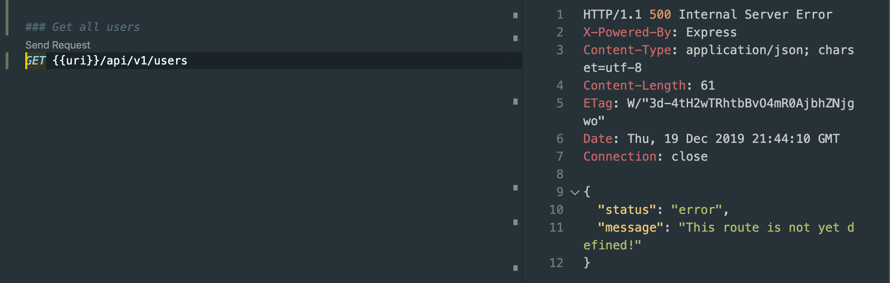

## Using 3rd-Party Middleware
#### `Morgan` which is a very popular logging middleware
- let's install it
- `npm i morgan `


- now we installed it.

- input `morgan github` on browser
- click index.js
- see the morgan function

- inside morgan function, it return:
```js
return function logger (req, res, next) {
    // request data
    req._startAt = undefined
    req._startTime = undefined
    req._remoteAddress = getip(req)

    // response data
    res._startAt = undefined
    res._startTime = undefined

    // record request start
    recordStartTime.call(req)

    function logRequest () {
      if (skip !== false && skip(req, res)) {
        debug('skip request')
        return
      }

      var line = formatLine(morgan, req, res)

      if (line == null) {
        debug('skip line')
        return
      }

      debug('log request')
      stream.write(line + '\n')
    };

    if (immediate) {
      // immediate log
      logRequest()
    } else {
      // record response start
      onHeaders(res, recordStartTime)

      // log when response finished
      onFinished(res, logRequest)
    }

    next()
  }
}
```
- now let's use morgan function to test middleware (app.js)
```js
//Using 3rd-Party Middleware ----- morgan
const fs = require('fs');
const express = require('express');
const morgan = require('morgan');

const app = express();

//1. middleware
app.use(morgan('dev'));
app.use(express.json()); //middleware, 中间件

app.use((req, res, next) => { //middleware
    console.log('Hello from the middleware 🐳');
    next();
});

app.use((req, res, next) => {
    req.requestTime = new Date().toISOString();
    next();
});
```


- we get the above info `GET /api/v1/tours 200 3.354 ms - 8744`
- we also can test 404


---


## Implementing the Users Rotues
- create a new app2.js
```js
const getAllUsers = (req, res) => {
    res.status(500).json({
        status: 'error',
        message: 'This route is not yet defined!'
    });
};

const getUser = (req, res) => {
    res.status(500).json({
        status: 'error',
        message: 'This route is not yet defined!'
    });
};

const createUser = (req, res) => {
    res.status(500).json({
        status: 'error',
        message: 'This route is not yet defined!'
    });
};

const updateUser = (req, res) => {
    res.status(500).json({
        status: 'error',
        message: 'This route is not yet defined!'
    });
};

const deleteUser = (req, res) => {
    res.status(500).json({
        status: 'error',
        message: 'This route is not yet defined!'
    });
};


/*try to use json*/

// app.get('/api/v1/tours', getAllTours);
// app.post('/api/v1/tours', createTour);
// app.get('/api/v1/tours/:id', getTour);
// app.patch('/api/v1/tours/:id', updateTour);
// app.delete('/api/v1/tours/:id', deleteTour);

//3. ROUTE
app.route('/api/v1/tours')
    .get(getAllTours)
    .post(createTour);

app.route('/api/v1/tours/:id')
    .get(getTour)
    .patch(updateTour)
    .delete(deleteTour);

app.route('/api/v1/users')
    .get(getAllUsers)
    .post(createUser);

app.route('/api/v1/users/:id')
    .get(getUser)
    .patch(updateUser)
    .delete(deleteUser);

//4. START SERVE    
const port = 3000;
app.listen(port, () => {
    console.log(`App running on port ${port}...`);
    console.log(`${__dirname}`)
});
```

---

## Creating and Mounting Multiple Routers
- update app2.js
```js
//Creating and Mounting Multiple Routers
const fs = require('fs');
const express = require('express');
const morgan = require('morgan');

const app = express();

//1. middleware
app.use(morgan('dev'));
app.use(express.json()); //middleware, 中间件

app.use((req, res, next) => { //middleware
    console.log('Hello from the middleware 🐳');
    next();
});

app.use((req, res, next) => {
    req.requestTime = new Date().toISOString();
    next();
});

const tours = JSON.parse(
    fs.readFileSync(`${__dirname}/dev-data/data/tours-simple.json`)
);


//2. ROUTE HANDLERs


const getAllTours = (req, res) => {
    console.log(req.requestTime);

    res.status(200).json({
        status: 'success',
        requestedAt: req.requestTime,
        results: tours.length,
        data: {
            tours: tours
        }
    });
};

const getTour = (req, res) => {
    console.log(req.params);
    console.log(req.params.id);
    console.log(typeof (req.params.id));

    const id = req.params.id * 1;
    console.log("after converting..." + typeof (id));

    const tour = tours.find(el => (el.id === id));
    if (!tour) {
        return res.status(404).json({
            status: 'fail',
            message: 'Invalid ID'
        });
    }
    res.status(200).json({
        status: 'success',
        data: {
            tour
        }
    });
};

const createTour = (req, res) => {
    // console.log(req.body);

    const newId = tours[tours.length - 1].id + 1;
    const newTour = Object.assign({ id: newId }, req.body);

    tours.push(newTour);
    fs.writeFile(
        `${__dirname}/dev-data/data/tours-simple.json`,
        JSON.stringify(tours),
        err => {
            res.status(201).json({
                status: 'success',
                data: {
                    tour: newTour
                }
            });
        }
    );
};

const updateTour = (req, res) => {
    if (req.params.id * 1 > tours.length) {
        return res.status(404).json({
            status: 'fail',
            message: 'Invalid ID'
        });
    }
    res.status(200).json({
        status: 'success',
        data: {
            tour: '<Updated tour here...>'
        }
    });
};

const deleteTour = (req, res) => {
    if (req.params.id * 1 > tours.length) {
        return res.status(404).json({
            status: 'fail',
            message: 'Invalid ID'
        });
    }
    res.status(204).json({//204 means not content
        status: 'success',
        data: null
    });
};

const getAllUsers = (req, res) => {
    res.status(500).json({
        status: 'error',
        message: 'This route is not yet defined!'
    });
};

const getUser = (req, res) => {
    res.status(500).json({
        status: 'error',
        message: 'This route is not yet defined!'
    });
};

const createUser = (req, res) => {
    res.status(500).json({
        status: 'error',
        message: 'This route is not yet defined!'
    });
};

const updateUser = (req, res) => {
    res.status(500).json({
        status: 'error',
        message: 'This route is not yet defined!'
    });
};

const deleteUser = (req, res) => {
    res.status(500).json({
        status: 'error',
        message: 'This route is not yet defined!'
    });
};


/*try to use json*/

// app.get('/api/v1/tours', getAllTours);
// app.post('/api/v1/tours', createTour);
// app.get('/api/v1/tours/:id', getTour);
// app.patch('/api/v1/tours/:id', updateTour);
// app.delete('/api/v1/tours/:id', deleteTour);

//3. ROUTE
const tourRouter = express.Router();
const userRouter = express.Router();

tourRouter.route('/')
    .get(getAllTours)
    .post(createTour);

tourRouter.route('/:id')
    .get(getTour)
    .patch(updateTour)
    .delete(deleteTour);

userRouter.route('/')
    .get(getAllUsers)
    .post(createUser);

userRouter.route('/:id')
    .get(getUser)
    .patch(updateUser)
    .delete(deleteUser);

app.use('/api/v1/tours', tourRouter);
app.use('/api/v1/users', userRouter);

//4. START SERVE    
const port = 3000;
app.listen(port, () => {
    console.log(`App running on port ${port}...`);
    console.log(`${__dirname}`)
});
```

- done!
---


## A Better File Structure
### create a new folder `router`


- we need to change path since we change the tourRoutes's path
### 4-NATOURS/routes/tourRoutes.js
```js
const express = require('express');
const fs = require('fs');

const tours = JSON.parse(
    // fs.readFileSync(`${__dirname}/dev-data/data/tours-simple.json`)
    fs.readFileSync(`${__dirname}/../dev-data/data/tours-simple.json`)
);

const getAllTours = (req, res) => {
    console.log(req.requestTime);

    res.status(200).json({
        status: 'success',
        requestedAt: req.requestTime,
        results: tours.length,
        data: {
            tours: tours
        }
    });
};

const getTour = (req, res) => {
    console.log(req.params);
    console.log(req.params.id);
    console.log(typeof (req.params.id));

    const id = req.params.id * 1;
    console.log("after converting..." + typeof (id));

    const tour = tours.find(el => (el.id === id));
    if (!tour) {
        return res.status(404).json({
            status: 'fail',
            message: 'Invalid ID'
        });
    }
    res.status(200).json({
        status: 'success',
        data: {
            tour
        }
    });
};

const createTour = (req, res) => {
    // console.log(req.body);

    const newId = tours[tours.length - 1].id + 1;
    const newTour = Object.assign({ id: newId }, req.body);

    tours.push(newTour);
    fs.writeFile(
        `${__dirname}/../dev-data/data/tours-simple.json`,
        JSON.stringify(tours),
        err => {
            res.status(201).json({
                status: 'success',
                data: {
                    tour: newTour
                }
            });
        }
    );
};

const updateTour = (req, res) => {
    if (req.params.id * 1 > tours.length) {
        return res.status(404).json({
            status: 'fail',
            message: 'Invalid ID'
        });
    }
    res.status(200).json({
        status: 'success',
        data: {
            tour: '<Updated tour here...>'
        }
    });
};

const deleteTour = (req, res) => {
    if (req.params.id * 1 > tours.length) {
        return res.status(404).json({
            status: 'fail',
            message: 'Invalid ID'
        });
    }
    res.status(204).json({//204 means not content
        status: 'success',
        data: null
    });
};

const router = express.Router();

router.route('/')
    .get(getAllTours)
    .post(createTour);

router.route('/:id')
    .get(getTour)
    .patch(updateTour)
    .delete(deleteTour);

module.exports = router;
```
---
### 4-NATOURS/routes/userRoutes.js
```js
const express = require('express');

const getAllUsers = (req, res) => {
    res.status(500).json({
        status: 'error',
        message: 'This route is not yet defined!'
    });
};

const getUser = (req, res) => {
    res.status(500).json({
        status: 'error',
        message: 'This route is not yet defined!'
    });
};

const createUser = (req, res) => {
    res.status(500).json({
        status: 'error',
        message: 'This route is not yet defined!'
    });
};

const updateUser = (req, res) => {
    res.status(500).json({
        status: 'error',
        message: 'This route is not yet defined!'
    });
};

const deleteUser = (req, res) => {
    res.status(500).json({
        status: 'error',
        message: 'This route is not yet defined!'
    });
};

const router = express.Router();

router.route('/')
    .get(getAllUsers)
    .post(createUser);

router.route('/:id')
    .get(getUser)
    .patch(updateUser)
    .delete(deleteUser);

module.exports = router;
```
---


### app2.js
```js
//A Better File Structure
const express = require('express');
const morgan = require('morgan');

const tourRouter = require('./routes/tourRoutes');
const userRouter = require('./routes/userRoutes');

const app = express();

//1. middleware
app.use(morgan('dev'));
app.use(express.json()); //middleware, 中间件

app.use((req, res, next) => { //middleware
    console.log('Hello from the middleware 🐳');
    next();
});

app.use((req, res, next) => {//middleware
    req.requestTime = new Date().toISOString();
    next();
});


/*try to use json*/

// app.get('/api/v1/tours', getAllTours);
// app.post('/api/v1/tours', createTour);
// app.get('/api/v1/tours/:id', getTour);
// app.patch('/api/v1/tours/:id', updateTour);
// app.delete('/api/v1/tours/:id', deleteTour);

//3. ROUTE


app.use('/api/v1/tours', tourRouter);
app.use('/api/v1/users', userRouter);

//4. START SERVE    
const port = 3000;
app.listen(port, () => {
    console.log(`App running on port ${port}...`);
    console.log(`${__dirname}`)
});
```


- done!
---

### create a new folder `controllers`

- we still can sperate these files into new folers
#### `controllers/tourController.js`
```js
const fs = require('fs');

const tours = JSON.parse(
    // fs.readFileSync(`${__dirname}/dev-data/data/tours-simple.json`)
    fs.readFileSync(`${__dirname}/../dev-data/data/tours-simple.json`)
);

exports.getAllTours = (req, res) => {//exports keyword
    console.log(req.requestTime);

    res.status(200).json({
        status: 'success',
        requestedAt: req.requestTime,
        results: tours.length,
        data: {
            tours: tours
        }
    });
};

exports.getTour = (req, res) => {
    console.log(req.params);
    console.log(req.params.id);
    console.log(typeof (req.params.id));

    const id = req.params.id * 1;
    console.log("after converting..." + typeof (id));

    const tour = tours.find(el => (el.id === id));
    if (!tour) {
        return res.status(404).json({
            status: 'fail',
            message: 'Invalid ID'
        });
    }
    res.status(200).json({
        status: 'success',
        data: {
            tour
        }
    });
};

exports.createTour = (req, res) => {
    // console.log(req.body);

    const newId = tours[tours.length - 1].id + 1;
    const newTour = Object.assign({ id: newId }, req.body);

    tours.push(newTour);
    fs.writeFile(
        `${__dirname}/../dev-data/data/tours-simple.json`,
        JSON.stringify(tours),
        err => {
            res.status(201).json({
                status: 'success',
                data: {
                    tour: newTour
                }
            });
        }
    );
};

exports.updateTour = (req, res) => {
    if (req.params.id * 1 > tours.length) {
        return res.status(404).json({
            status: 'fail',
            message: 'Invalid ID'
        });
    }
    res.status(200).json({
        status: 'success',
        data: {
            tour: '<Updated tour here...>'
        }
    });
};

exports.deleteTour = (req, res) => {
    if (req.params.id * 1 > tours.length) {
        return res.status(404).json({
            status: 'fail',
            message: 'Invalid ID'
        });
    }
    res.status(204).json({//204 means not content
        status: 'success',
        data: null
    });
};
```
#### `routes/tourRoutes.js`
```js
// const express = require('express');

// const tourController = require('../controllers/tourController');


// const router = express.Router();

// router.route('/')
//     .get(tourController.getAllTours)
//     .post(tourController.createTour);

// router.route('/:id')
//     .get(tourController.getTour)
//     .patch(tourController.updateTour)
//     .delete(tourController.deleteTour);

// module.exports = router;


/***************************************************************************/

//2ND way, is similar to React.js
const express = require('express');

const { getAllTours, createTour, getTour, updateTour, deleteTour } = require('../controllers/tourController');


const router = express.Router();

router.route('/')
    .get(getAllTours)
    .post(createTour);

router.route('/:id')
    .get(getTour)
    .patch(updateTour)
    .delete(deleteTour);

module.exports = router;
```

- still work!
---


#### `controllers/userController.js`
```js

exports.getAllUsers = (req, res) => {
    res.status(500).json({
        status: 'error',
        message: 'This route is not yet defined!'
    });
};

exports.getUser = (req, res) => {
    res.status(500).json({
        status: 'error',
        message: 'This route is not yet defined!'
    });
};

exports.createUser = (req, res) => {
    res.status(500).json({
        status: 'error',
        message: 'This route is not yet defined!'
    });
};

exports.updateUser = (req, res) => {
    res.status(500).json({
        status: 'error',
        message: 'This route is not yet defined!'
    });
};

exports.deleteUser = (req, res) => {
    res.status(500).json({
        status: 'error',
        message: 'This route is not yet defined!'
    });
};
```
#### `routes/userController.js`
```js
const express = require('express');
const { getAllUsers, createUser, getUser, updateUser, deleteUser } = require('../controllers/userController');


const router = express.Router();

router.route('/')
    .get(getAllUsers)
    .post(createUser);

router.route('/:id')
    .get(getUser)
    .patch(updateUser)
    .delete(deleteUser);

module.exports = router;
```

- done!