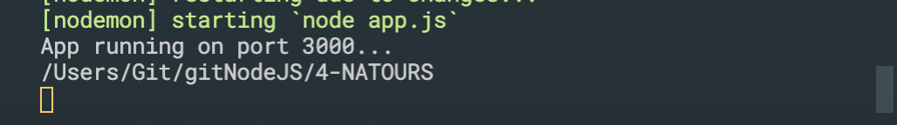

# NodeJS
Node_Js guide

- `brew install node`


### about `__filename`
- for example:
- app.js
```js
const port = 3000;
app.listen(port, () => {
    console.log(`App running on port ${port}...`);
    console.log(`${__dirname}`)
});
```



## MongoDB start
```ruby
cd cd /usr/local/bin
brew services start mongodb-community
```