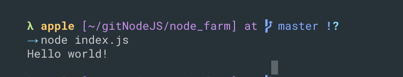

# introduce
```javascript
>node
> 2+3
5
> 'tomzheng'.toUpperCase()
'TOMZHENG'
> process.exit()

```
---
```js
→ node                                                                                                                       [bfd8e71]
> const name = 'jonas'
undefined
> name
'jonas'
> 7+3
10
> .exit
```
- if you want to exit terminal
`CONTROL+D`

- if you want to `tab`
- `node`
- `TAB`

---
```js
> 3*8
24
> +6
6
> _+6
12
> _-30
-18
> String.
String.__defineGetter__      String.__defineSetter__      String.__lookupGetter__      String.__lookupSetter__
String.__proto__             String.hasOwnProperty        String.isPrototypeOf         String.propertyIsEnumerable
String.toLocaleString        String.valueOf               

String.apply                 String.arguments             String.bind                  String.call
String.caller                String.constructor           String.toString              

String.fromCharCode          String.fromCodePoint         String.length                String.name
String.prototype             String.raw             
```
---
- create an index.js
```js
const hello = 'Hello world!';
console.log(hello);
```

---
