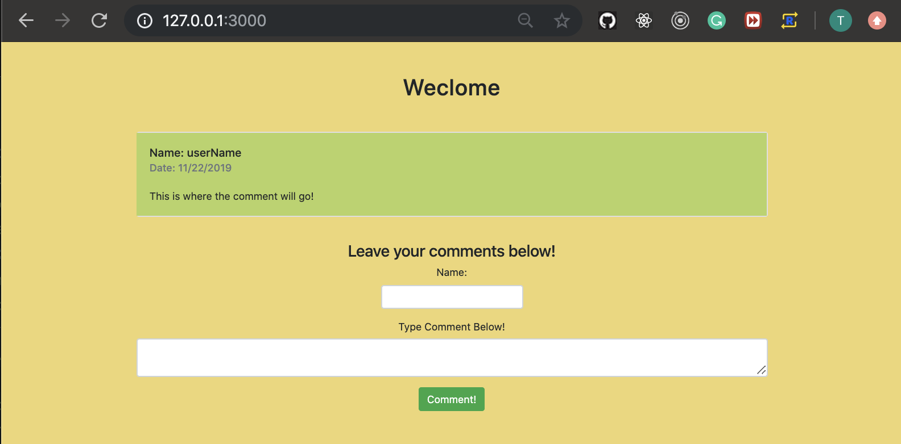
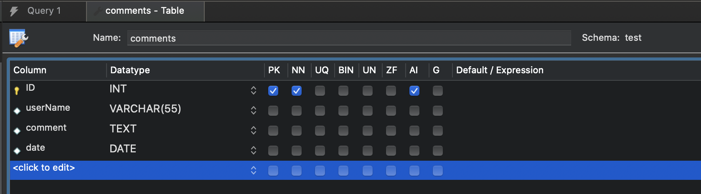
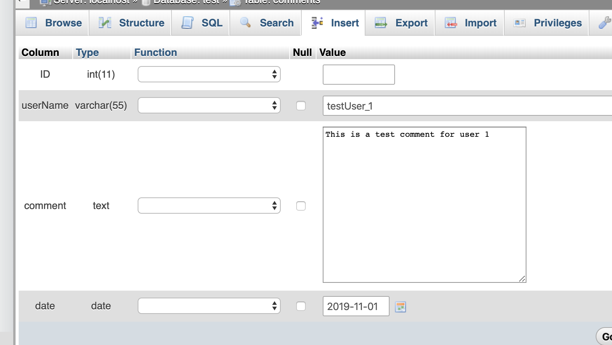
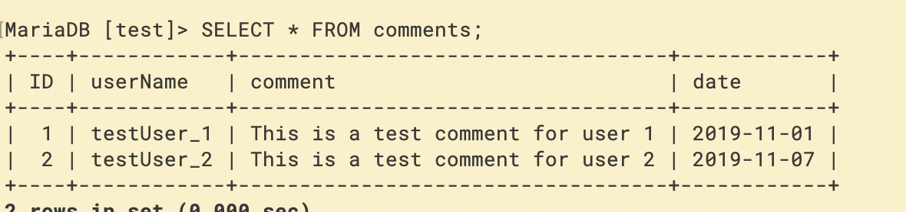
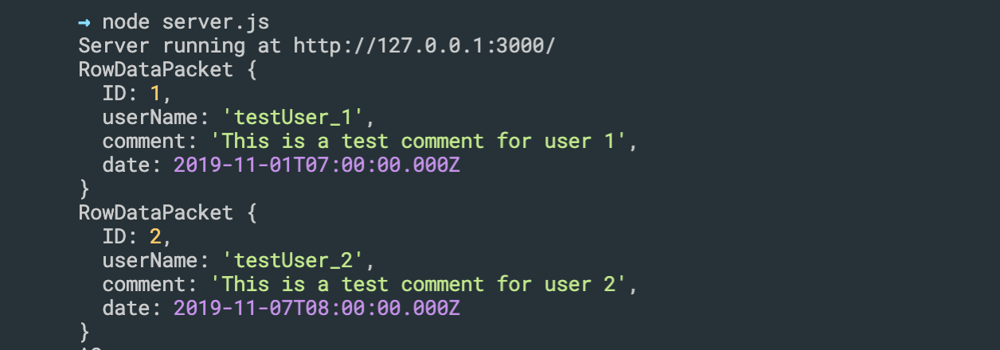
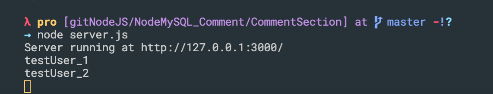
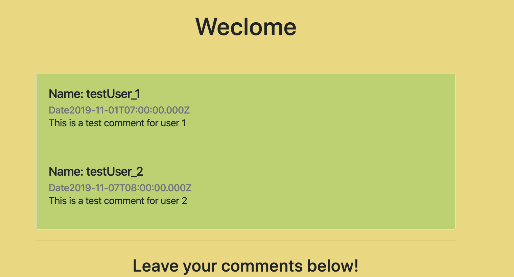

### import bootstrap
```html
<!DOCTYPE html>
<html lang="en">
<head>
    <meta charset="UTF-8">
    <meta name="viewport" content="width=device-width, initial-scale=1.0">
    <meta http-equiv="X-UA-Compatible" content="ie=edge">
    <title>Comment Section</title>
    <link rel="stylesheet" href="https://stackpath.bootstrapcdn.com/bootstrap/4.1.1/css/bootstrap.min.css" integrity="sha384-WskhaSGFgHYWDcbwN70/dfYBj47jz9qbsMId/iRN3ewGhXQFZCSftd1LZCfmhktB" crossorigin="anonymous">
    <link rel="stylesheet" href="styles/customStyles.css">
</head>
<body>
    <div class="container">
            <h1>Weclome</h1>

            <div id="comments" class="card mb-2">
                <div class="card-body">
                    <h5 class="card-title">Name: userName</h5>
                    <h6 class="card-subtitle text-muted">Date: 11/22/2019</h6><br>
                    This is where the comment will go!
                </div>
            </div>

            <hr>

            <div id="main-content">
                <h3>Leave your comments below!</h3>
                <div id="make-comment">
                    <div class="form-group">
                        <label for="name">Name:</label>
                        <input style="width:250px;" class="form-control" type="text" id="name" Required>
                    </div>

                    <div class="form-group">
                        <label for="message">Type Comment Below!</label>
                        <textarea class="form-control" id="message" Required></textarea>
                    </div>
                    <button type="button" class="btn btn-success" onclick="insertComment()">Comment!</button>
                </div>
            </div>
    </div>
</body>
</html>
```
---

### create a customStyles.css
- update css
```css
body{
    background-color: #eed773;
}

h1 {
    text-align: center;
    margin-top: 55px;
    margin-bottom: 55px;
}

.card-body{
    background-color: #b6d463
}

#main-content{
    text-align: center;
    margin-top: 25px;
}

#name{
    margin: 0 auto;
}
```
---

### npm install node
- `npm install node`

- create a server.js
```js
const http = require('http');
const fs = require('fs');

const hostname = '127.0.0.1'
const port = '3000'

const server = http.createServer((req, res) => {
    if (req.method == 'GET' && req.url == '/') {
        res.statusCode = 200;
        res.setHeader('content-Type', 'text/html');
        fs.createReadStream('./index.html').pipe(res);
    }
    else if (req.method == 'GET' && req.url == '/styles/customStyles.css') {
        res.statusCode = 200;
        res.setHeader('content-Type', 'text/css');
        fs.createReadStream('./styles/customStyles.css').pipe(res);
    }
});

server.listen(port, hostname, () => {
    console.log(`Server running at http://${hostname}:${port}/`)
});
```

---

### Connecting to Database

```sql
CREATE TABLE `test`.`comments` (
  `ID` INT NOT NULL AUTO_INCREMENT,
  `userName` VARCHAR(55) NULL,
  `comment` TEXT NULL,
  `date` DATE NULL,
  PRIMARY KEY (`ID`));
```

- insert data:

```sql
INSERT INTO `comments` (`ID`, `userName`, `comment`, `date`) 
VALUES (NULL, 'testUser_1', 'This is a test comment for user 1', '2019-11-01'), 
        (NULL, 'testUser_2', 'This is a test comment for user 2', '2019-11-07');
```

---

- install mysql
- `npm install mysql`

- create a DBConnection.js
```js
const mysql = require('mysql');

function getConnection() {
    var con = mysql.createConnection({
        host: "localhost",
        user: "root",
        password: "",
        database: "test"
    });
    return con;
}

module.exports.getConnection = getConnection;
```
---
- update server.js
```js
const http = require('http');
const fs = require('fs');
const con = require("./DBConnection");

const hostname = '127.0.0.1'
const port = '3000'

const server = http.createServer((req, res) => {
    if (req.method == 'GET' && req.url == '/') {
        res.statusCode = 200;
        res.setHeader('content-Type', 'text/html');
        fs.createReadStream('./index.html').pipe(res);

        var conn = con.getConnection();

        conn.query('SELECT * FROM test.comments', function (error, results, fields) {
            if (error) {
                throw error;
            }
            results.forEach((comment) => {
                console.log(comment);
            });
        });

        conn.end();
    }
    else if (req.method == 'GET' && req.url == '/styles/customStyles.css') {
        res.statusCode = 200;
        res.setHeader('content-Type', 'text/css');
        fs.createReadStream('./styles/customStyles.css').pipe(res);
    }
});

server.listen(port, hostname, () => {
    console.log(`Server running at http://${hostname}:${port}/`)
});
```

---
- update serve.js
```js
        conn.query('SELECT * FROM test.comments', function (error, results, fields) {
            if (error) {
                throw error;
            }
            results.forEach((comment) => {
                console.log(comment.userName);
            });
        });
```

---

### Load Comments From DataBase(Ajax)

- updating index.html
```html
<!DOCTYPE html>
<html lang="en">
<head>
    <meta charset="UTF-8">
    <meta name="viewport" content="width=device-width, initial-scale=1.0">
    <meta http-equiv="X-UA-Compatible" content="ie=edge">
    <title>Comment Section</title>
    <link rel="stylesheet" href="https://stackpath.bootstrapcdn.com/bootstrap/4.1.1/css/bootstrap.min.css" integrity="sha384-WskhaSGFgHYWDcbwN70/dfYBj47jz9qbsMId/iRN3ewGhXQFZCSftd1LZCfmhktB" crossorigin="anonymous">
    <link rel="stylesheet" href="styles/customStyles.css">
    <script src="functions.js"></script>
</head>
<body onload="loadComments()">
    <div class="container">
            <h1>Weclome</h1>
```
- update server.js
```js
const http = require('http');
const fs = require('fs');
const con = require("./DBConnection");

const hostname = '127.0.0.1'
const port = '3000'

const server = http.createServer((req, res) => {
    if (req.method == 'GET' && req.url == '/') {
        res.statusCode = 200;
        res.setHeader('content-Type', 'text/html');
        fs.createReadStream('./index.html').pipe(res);

        var conn = con.getConnection();

        conn.query('SELECT * FROM test.comments', function (error, results, fields) {
            if (error) {
                throw error;
            }
            results.forEach((comment) => {
                console.log("The comments are: " + comment.comment);
            });
        });

        conn.end();
    }
    else if (req.method == 'GET' && req.url == '/styles/customStyles.css') {
        res.statusCode = 200;
        res.setHeader('content-Type', 'text/css');
        fs.createReadStream('./styles/customStyles.css').pipe(res);
    }
    else if (req.method == 'GET' && req.url == '/functions.js') {
        res.writeHead(200, { "Content-Type": "text/javascript" });
        fs.createReadStream("./functions.js").pipe(res);
    }
    else if (req.method == "GET" && req.url == '/home') {
        res.statusCode == 200;
        res.setHeader('Content-Type', 'application/json');

        var conn = con.getConnection();

        conn.query('SELECT * FROM test.comments', function (error, results, fields) {
            if (error) {
                throw error;
            }
            var comments = JSON.stringify(results);
            res.end(comments);
        });
        conn.end();
    }
});
```
- create functions.js
```js
function loadComments() {
    var xhttp = new XMLHttpRequest();

    xhttp.onreadystatechange = function () {
        if (this.readyState == 4 && this.status == 200) {
            var result = this.responseText;
            var results = JSON.parse(result);

            results.forEach((comment) => {
                var node = document.createElement("div");
                var name = document.createElement("H5");
                var date = document.createElement("H6");
                var message = document.createElement("P");

                node.className = 'card-body';
                name.className = 'card-title';
                date.className = 'card-subtitle text-muted';

                var textName = document.createTextNode('Name: ' + comment.userName);
                var textDate = document.createTextNode('Date' + comment.date);
                var textMessage = document.createTextNode(comment.comment);

                name.appendChild(textName);
                date.appendChild(textDate);
                message.appendChild(textMessage);

                node.appendChild(name);
                node.appendChild(date);
                node.appendChild(message);

                document.getElementById('comments').appendChild(node);
            });
        }
    }

    xhttp.open("GET", "/home", true);
    xhttp.send();
}
```
- run on serve
- `node server.js`

---
