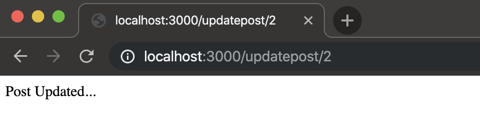
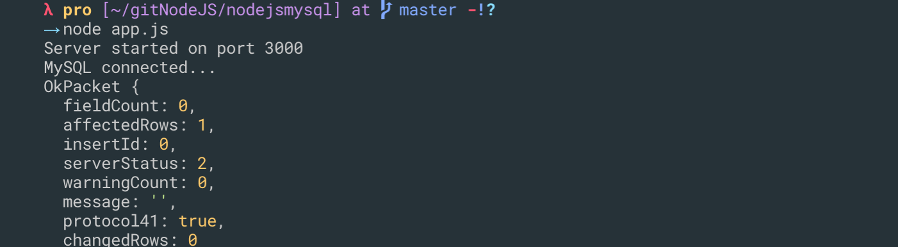

### First thing we need to do is: Create a package.json file
- `npm init`

- description: `Sample app for using mysql with node`
- entry point: (index.js) `app.js`
---

- and then just `enter` 
---

- input `→ npm install --save mysql express`
---
- create a app.js

- option:
- `npm install -g nodemon` , but i don't use
---
- app.js
```js
const express = require('express')
const mysql = require('mysql')

const app = express();

app.listen('3000', () => {
    console.log('Server started on port 3000');
})
```
- `node app.js`

---

- update app.js
```js
const express = require('express')
const mysql = require('mysql')

// Create connection
const db = mysql.createConnection({
    host: 'localhost',
    user: 'root',
    password: '',
    // database: 'nodemysql'
    // Note: the first time don't put database: 'nodemysql' here, since you have't created this database
});

//Connect
db.connect((err) => {
    if (err) {
        throw err;
    }
    console.log('MySQL connected...');
});

const app = express();

//Create DB
app.get('/createdb', (req, res) => {
    let sql = 'CREATE DATABASE nodemysql';
    db.query(sql, (err, result) => {
        if (err) throw err;
        console.log(result);
        res.send('Database created...');
    });
});

app.listen('3000', () => {
    console.log('Server started on port 3000');
})
```
- `node app.js`

---

---

---

### CREATE A table
- update app.js
```js
//Create table
app.get('/createpoststable', (req, res) => {
    let sql = 'CREATE TABLE posts(id int AUTO_INCREMENT, title VARCHAR(255), body VARCHAR(255), PRIMARY KEY (id) )';
    db.query(sql, (err, result) => {
        if (err) throw err;
        console.log(result)
        res.send('Posts table created...')
    })
});
```

---

---

### add post 1
- update app.js
```js
//Insert post1
app.get('/addpost1', (req, res) => {
    let post = {
        title: 'Post One',
        body: 'This is post number one'
    };
    let sql = 'INSERT INTO posts SET ?';
    let query = db.query(sql, post, (err, result) => {
        if (err) throw err;
        console.log(result)
        res.send('Post 1 added...')
    });
})
```

---

---

---

### add post 2
- update app.js
```js
//Insert post2
app.get('/addpost2', (req, res) => {
    let post = {
        title: 'Post Two',
        body: 'This is post number two'
    };
    let sql = 'INSERT INTO posts SET ?';
    let query = db.query(sql, post, (err, result) => {
        if (err) throw err;
        console.log(result)
        res.send('Post 2 added...')
    });
})
```

---

---

---

### SELECT * FROM XXX
```js
//Select posts
app.get('/getposts', (req, res) => {
    let sql = 'SELECT * FROM posts';
    let query = db.query(sql, (err, results) => {
        if (err) throw err;
        console.log(results)
        res.send('Posts fetched...')
    });
})

app.listen('3000', () => {
    console.log('Server started on port 3000');
})
```

---

---


### SELECT SINGLE post
- update app.js
- backtick for sql query, since we have to insert a variable
```js
//Select single post
app.get('/getpost/:id', (req, res) => {
    let sql = `SELECT * FROM posts WHERE id = ${req.params.id}`;
    //for sql here, putting a variable here, so i'm going to use backticks
    let query = db.query(sql, (err, result) => {
        if (err) throw err;
        console.log(result)
        res.send('Post fetched...')
    });
})
```

---
- insert a variable `id = 1`

---

- insert `id = 2`

---

---

### UPDATE 
```js
//Update post
app.get('/updatepost/:id', (req, res) => {
    let newTitle = 'Updated Title';
    let sql = `UPDATE posts SET title = '${newTitle}' WHERE id = ${req.params.id}`;
    //for sql here, putting a variable here, so i'm going to use backticks
    let query = db.query(sql, (err, result) => {
        if (err) throw err;
        console.log(result)
        res.send('Post Updated...')
    });
})
```

---

---

---

---

---

### DELETE 
```js
//Delete post
app.get('/deletepost/:id', (req, res) => {
    let sql = `DELETE FROM posts WHERE id = ${req.params.id}`;
    //for sql here, putting a variable here, so i'm going to use backticks
    let query = db.query(sql, (err, result) => {
        if (err) throw err;
        console.log(result)
        res.send('Post deleted...')
    });
})
```

---

---

---
