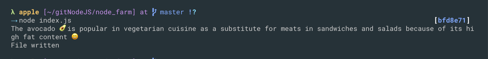

### Reading and Writing Files

- reading and writing from files
```js
const fs = require('fs');

const textIn = fs.readFileSync('./txt/input.txt', 'utf-8')
console.log(textIn)
```

`The avocado 🥑 is popular in vegetarian cuisine as a substitute for meats in sandwiches and salads because of its high fat content 😄`
---

---
### writting files
```js
//reading and writing from files
const fs = require('fs');

const textIn = fs.readFileSync('./txt/input.txt', 'utf-8')
console.log(textIn)

const textOut = `this is what we know about avocado: ${textIn}.\nCreate on ${Date.now()} `;
fs.writeFileSync('./txt/output.txt', textOut)
console.log('File written')
```

---


